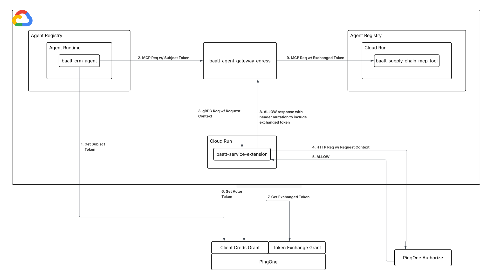

# Baseline Autonomous Agent to Tool

A CRM agent restocks inventory by calling an external supply-chain [MCP](https://modelcontextprotocol.io/docs/2026-07-28/getting-started/intro) tool.

Every MCP request is intercepted by the [GCP Agent Gateway](https://docs.cloud.google.com/gemini-enterprise-agent-platform/govern/gateways/agent-gateway-overview), which calls an extension service via [Envoy ext_proc](https://www.envoyproxy.io/docs/envoy/latest/configuration/http/http_filters/ext_proc_filter). The extension service validates the agent's token, then asks [PingOne Authorize](https://www.pingidentity.com/en/product/pingone-authorize.html) whether this agent is allowed to call this tool at this time (agent identity + business hours). On PERMIT, it performs an [RFC 8693 token exchange](https://docs.pingidentity.com/pingone/use_cases/p1_oauth_2_token_exchange_delegation.html), minting a short-lived token scoped specifically to the supply-chain tool, and injects it before the request is forwarded.

## Architecture



Following the diagram: the agent authenticates to PingOne as its own client and carries that token on every MCP request, which Agent Runtime routes through the gateway to the extension service. The service asks PingOne Authorize for a decision; on PERMIT it performs a delegation token exchange, minting a token audienced for the tool, and injects it into the request before it's forwarded to the MCP server.

## When to use this pattern

Use this pattern when an autonomous agent needs to call a protected tool but should not hold a standing credential for it. The agent proves only its own identity; the gateway is where authorization is decided and a scoped, short-lived token is minted per request. This gives you:

- **No standing tool credentials in the agent.** The agent never holds a token that works against the tool, so a compromised agent has nothing to leak.
- **Least privilege.** Each tool token is scoped to one resource and expires quickly.
- **Delegation proof.** Every tool token carries an `act` claim naming the extension service as the actor. PingOne only stamps it after verifying the agent's token licensed that actor, so the tool can see exactly who acted for the agent.
- **Centralized policy.** PingOne Authorize owns the permit decision. Policy can be updated centrally without modifying or redeploying the agent or the MCP server.

## Token Chain

The agent mints its own `client_credentials` token and attaches it to every MCP request. The extension service exchanges it for a tool-scoped token via RFC 8693, adding itself as the `act` (actor) claim. PingOne enforces the delegation itself: the agent's token carries `may_act` naming the extension as the only actor allowed to exchange it, and the exchange fails closed unless the actor token's client matches.

**Subject token** (agent's `client_credentials` token, carried on every MCP request):
- Represents the agent (see client id; a `client_credentials` token carries no `sub`)
- Minted by the agent (see client id and grant type)
- For use on the agent gateway (see aud)
- Ability to invoke the downstream restock tool
- Licensed for exactly one next actor: the extension service (see `may_act`)
```json
{
  "iss": "https://auth.pingone.com/<env-id>/as",
  "client_id": "<agent-client-id>",
  "aud": "google-cloud-agent-gateway",
  "scope": "supply-chain:restock",
  "grant_type": "client_credentials",
  "may_act": { "sub": "<ext-svc-client-id>" }
}
```

**Tool token** (minted by the extension service via RFC 8693, injected before forwarding to the MCP tool):
- Represents the agent (see sub, carried over from the subject token's client id)
- Minted by the agent gateway extension service (see client id and grant type)
- For use on the supply chain mcp tool (see aud)
- Ability to invoke the restock tool
- Delegation proof: the extension acted for the agent, and PingOne verified that against `may_act` at exchange time (see act)
```json
{
  "iss": "https://auth.pingone.com/<env-id>/as",
  "sub": "<agent-client-id>",
  "client_id": "<ext-svc-client-id>",
  "aud": "supply-chain-mcp-tool",
  "scope": "supply-chain:restock",
  "grant_type": "urn:ietf:params:oauth:grant-type:token-exchange",
  "act": { "sub": "<ext-svc-client-id>" }
}
```

## Components

| Component | Role |
|---|---|
| [**Agent**](services/agent) | CRM agent acting as a MCP client, mints its own PingOne token as the delegation subject |
| [**Agent Gateway Extension Service**](services/agent-gateway-extension-service) | ext_proc handler, forwards request to PingOne Authorize, exchanges & injects IdP token |
| [**Supply Chain MCP Tool**](services/supply-chain-mcp-tool) | MCP server (`restock`), validates the injected token |
| [**Agent Gateway**](services/agent-gateway) | Google-managed policy enforcement point |
| **PingOne Authorize** | External policy decision point |
| **PingOne** | Identity Provider |

## Prerequisites

- Google Cloud project with billing enabled
- `gcloud` CLI authenticated against the target project
- Docker (to build service images)
- A PingOne environment with PingOne Authorize

## Deployment

### 1. Supply Chain MCP Tool
Follow the instructions in [supply-chain-mcp-tool](services/supply-chain-mcp-tool/README.md) to deploy this service to Cloud Run and register it in Agent Registry.

### 2. Agent Gateway Extension Service
Follow the instructions in [agent-gateway-extension-service](services/agent-gateway-extension-service/README.md) to deploy this service to Cloud Run.

### 3. Agent Gateway
Follow the instructions in [agent-gateway](services/agent-gateway/README.md) to create the gateway, attach the extension service, and register the egress destinations.

### 4. Agent
Follow the instructions in [agent](services/agent/README.md) to create the agent's PingOne app, deploy it to Agent Runtime, register it, and grant it egress.

## Verify

Trigger a test restock from the baseline root:

```bash
services/agent/.venv/bin/python trigger.py
```

A successful run ends with the agent reporting back, for example:

```
Your restock order for 500 units of WIDGET-9000 has been accepted.
The order ID is ORD-20240101-001.
```

To watch the delegation happen, follow the logs of the two Cloud Run services (`baatt-agent-gateway-extension-service` and `baatt-supply-chain-mcp-tool`) while the command runs. In order, you should see:

```
# Extension service: every MCP request (initialize, tools/list, tools/call)
# is validated, exchanged, and forwarded with a fresh tool token.
[ExtSvc] request authority="baatt-supply-chain-mcp-tool-...run.app" path="/mcp"
[ExtSvc] delegated tool token minted
[ExtSvc] injecting delegated token for baatt-supply-chain-mcp-tool-...run.app

# Extension service: PingOne Authorize is consulted on tools/call only.
[ExtSvc] authorize agent=<agent-client-id> hour=15
[ExtSvc] PingOne Authorize PERMIT agent=<agent-client-id>

# Supply chain tool: every request's token is verified (signature, issuer,
# audience, scope) before handling. The log shows who the call is for (sub),
# which audience it was minted for (aud), who acted for it (act.sub, the
# delegation proof), and the granted scope.
[SupplyChain] Token verified — sub=<agent-client-id> aud=[supply-chain-mcp-tool] act.sub=<ext-svc-client-id> scope="supply-chain:restock" forwarding to MCP handler

# Supply chain tool: the restock itself runs only after the PERMIT above.
[SupplyChain] tools/call restock — 500 units of WIDGET-9000 for region us-west-2
```

Two things worth knowing when reading these logs:

- The `initialize` and `tools/list` requests are the agent and tool negotiating the tool schema; only the final `tools/call` goes through PingOne Authorize.
- If the run fails with the agent saying it couldn't restock, the extension log is the place to look: a DENY from Authorize, a failed token exchange, or a validation error will all show there.
