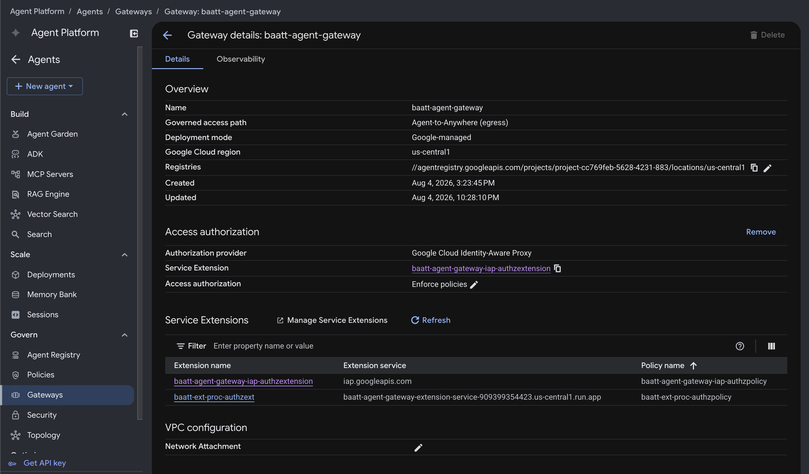
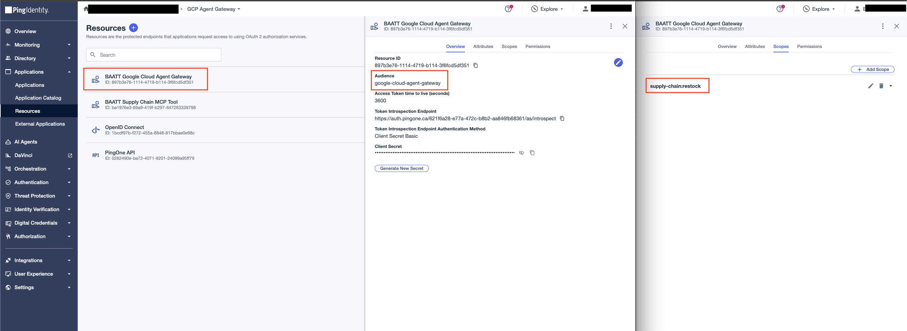

# Agent Gateway

The Agent Gateway is a **Google-managed** resource. You create it in the console and wire it with `gcloud`. It's the policy enforcement point: all the agent's egress is routed through it, and it calls the [extension service](../agent-gateway-extension-service/README.md) via Envoy [External Processing (`ext_proc`)](https://www.envoyproxy.io/docs/envoy/latest/configuration/http/http_filters/ext_proc_filter) on every request.

### 1. Configure environment values

```bash
cp .env.sample .env
make attach
```

| Variable | Value |
|---|---|
| `GC_REGION` | Same region as the gateway and Cloud Run services |
| `GC_GATEWAY_NAME` | `baatt-agent-gateway` |
| `GC_EXT_SVC_NAME` | Deployed extension service Cloud Run name |
| `GC_AUTHZ_EXTENSION` / `GC_AUTHZ_POLICY` | Names for the two resources this creates |


## 2. Create the gateway

In the console: **Agent Platform → Govern → Gateways → Add gateway**.

| Field | Value |
|---|---|
| **Name** | `baatt-agent-gateway` |
| **Region** | Same as the two Cloud Run services |
| **Deployment mode** | Google-managed |
| **Governed Access Path** | Agent-to-Anywhere (egress) |
| **Access Authorization** | Enforce policies |

## 3. Attach the extension service

This wires the extension service to the gateway as a `CONTENT_AUTHZ` authorization extension scoped to `/mcp` — two resources: an **authorization extension** (points at your Cloud Run host) and an **authorization policy** (binds that extension to the gateway).

Configure and run:

```bash
make attach
```

`make attach` renders `authz-extension.tmpl.yaml` and `authz-policy.tmpl.yaml`
(filling in your project, region, and the ext-svc's live Cloud Run host), then
imports both with `gcloud`. Run `make render` alone to inspect the generated YAML
without importing. Config:

> **You'll now see two Service Extensions on the gateway — that's expected.**
> They're complementary, not duplicates:
>
> | Extension | Profile | Service | Role |
> |---|---|---|---|
> | `baatt-agent-gateway-iap-authzextension` | `REQUEST_AUTHZ` | `iap.googleapis.com` | Google-managed, **auto-created** with the gateway. Enforces the IAP identity/egress check (`iap.egressor`) — this is the "Auth provider: Google Cloud Identity-Aware Proxy" shown on the gateway. |
> | `baatt-ext-proc-authzext` | `CONTENT_AUTHZ` | your Cloud Run ext-svc | The one you just created. Does the PingOne token exchange and `Authorization` injection. |
>
> The IAP extension answers *"is this agent allowed to egress at all?"*; yours
> answers *"mint and inject the tool credential."* Both run on every `/mcp`
> request — leave the IAP one alone.



## 4. Register egress destinations

The gateway governs **all** agent egress, so every host the agent reaches must be
a registered destination in **Agent Platform → Govern → Agent Registry**. Two of
those are already handled:

- **MCP tool** — registered under **MCP Servers** when you deployed it (it's an
  MCP server, not an endpoint).
- **Google APIs** (`aiplatform`, `iamcredentials`, `telemetry` on
  `*.mtls.googleapis.com`) — **auto-created** with the gateway for the runtime's
  own egress. Leave them alone.

So the only endpoint you add here is **PingOne** — under **Endpoints → Add
endpoint**, Destination URL = your PingOne host (e.g. `https://auth.pingone.ca`).


## 5. Create the PingOne Resource for the gateway

In PingOne, create a **Resource** named `BAATT Google Cloud Agent Gateway` with the `supply-chain:restock` scope and `google-cloud-agent-gateway` audience.

This resource mints the agent's subject token, so it must license the extension as the one allowed next actor. On the resource's **Attributes** tab, configure one attribute:

| Attribute | Required | Advanced Expression |
|---|---|---|
| `may_act` | no | `{"sub":"<EXT-SVC-CLIENT-ID>"}` |

`may_act` is a flat constant naming the extension as the sole next actor — this is what the tool resource's `act` check compares against at exchange time. Nothing ever exchanges onto this resource (only `client_credentials` mints), so no `act` attribute is needed here either; the delegation proof lives entirely in the tool resource's `act` mapping, and the agent's identity rides in `client_id`.

The `BAATT Supply Chain MCP Tool` resource needs the matching `act` mapping on its side — see the [supply chain MCP tool's README](../supply-chain-mcp-tool/README.md#1-create-the-supply-chain-mcp-tool-resource-in-pingone).


