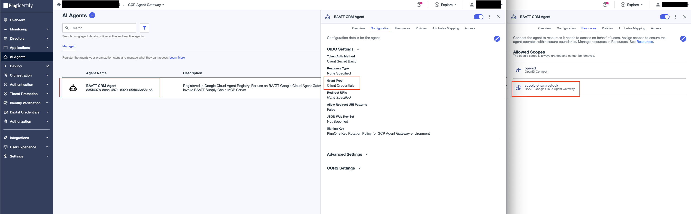
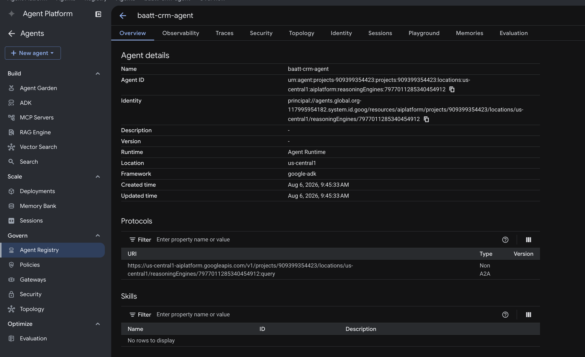

# CRM Agent

An ADK agent deployed to **Agent Runtime**. It is an MCP client: it connects to the supply-chain MCP tool and calls `restock`.

The agent authenticates to PingOne as its **own** client and sends that token as the Authorization Bearer on each MCP request. Agent Runtime routes that egress through the Agent Gateway (Agent-to-Anywhere), where the extension service uses the agent's token as the **subject** of an RFC 8693 delegation exchange, minting a tool-audienced token.

## Configure

**1. Create the agent's PingOne AI Agent**

- **Name:** BAATT CRM Agent
- **Grant type:** Client Credentials
- Assign the `google-cloud-agent-gateway` resource so it may request the `supply-chain:restock` scope.



**2. Fill in `.env`:**

```bash
cp .env.sample .env
```

| Variable | Value |
|---|---|
| `GC_PROJECT_ID` | Target project ID |
| `GC_REGION` | Deploy region, e.g. `us-central1` |
| `AGENT_DISPLAY_NAME` | Display name for the Reasoning Engine, e.g. `baatt-crm-agent` |
| `GC_AGENT_GATEWAY` | Full gateway path: `projects/<id>/locations/<region>/agentGateways/<name>` |
| `TOOL_MCP_URL` | The MCP tool's `/mcp` endpoint |
| `AGENT_IDP_TOKEN_ENDPOINT` | Agent PingOne app token endpoint |
| `AGENT_IDP_CLIENT_ID` | Agent PingOne app Client ID |
| `AGENT_IDP_CLIENT_SECRET` | Agent PingOne app Client Secret |
| `AGENT_IDP_SCOPE` | Scope the agent requests, e.g. `supply-chain:restock` |

## Deploy

```bash
make deploy
```

`deploy.py` creates the Reasoning Engine with `identity_type = AGENT_IDENTITY`, binds it to the gateway, and grants `roles/iap.egressor` on the Agent Registry so the engine can reach all registered endpoints.


