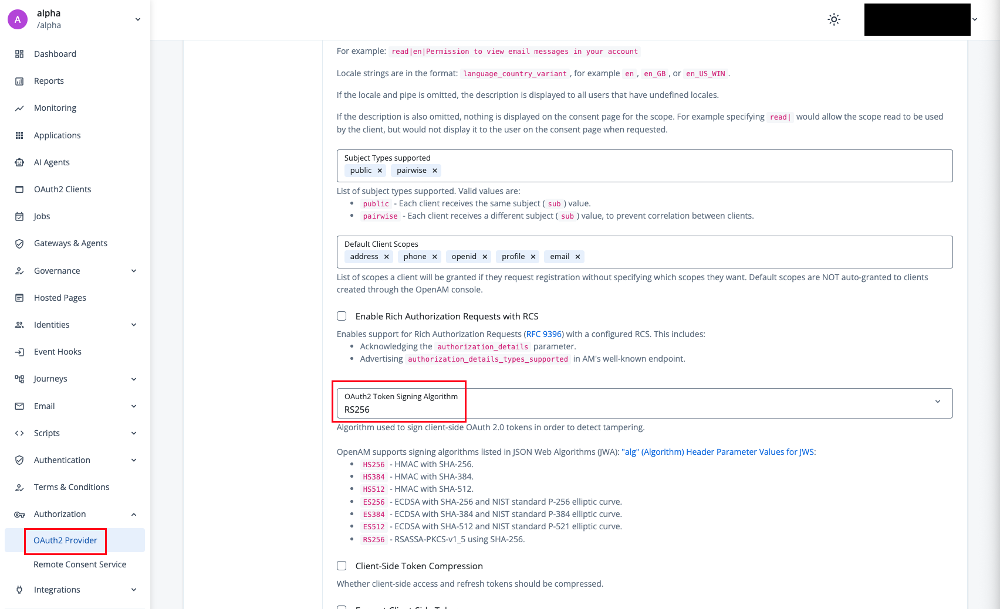
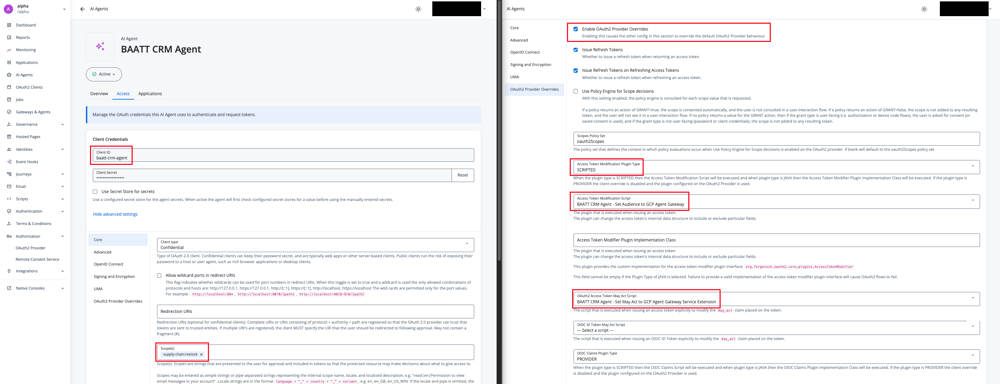

# CRM Agent

An ADK agent deployed to **Agent Runtime**. It is an MCP client: it connects to the supply-chain MCP tool and calls `restock`.

The agent authenticates to PingOne AIC as its **own** client and sends that token as the Authorization Bearer on each MCP request. Agent Runtime routes that egress through the Agent Gateway (Agent-to-Anywhere), where the extension service uses the agent's token as the **subject** of an RFC 8693 delegation exchange, minting a tool-audienced token.

## Configure

**1. Realm-wide: set the OAuth2 token signing algorithm to RS256**

In **Authorization → OAuth2 Provider → Advanced**, set:

- **OAuth2 Token Signing Algorithm:** `RS256`



Without this, access tokens are signed with HS256 (a shared-secret HMAC), which our resource servers cannot validate via JWKS. This is a realm-level setting, so it applies to every client in this walkthrough (agent, extension service) — set it once.

**2. Create the two AIC scripts the agent's client will reference**

**A. OAuth2 Access Token Modification Script**

In **Authorization → Scripts → OAuth2 Access Token Modification**:

- **Script Engine:** Next Generation
- **Name:** BAATT CRM Agent - Set Audience to GCP Agent Gateway
- **Description:** AI Agent gets a client credentials token and this script sets the audience of this token to the BAATT GCP Agent Gateway.

AIC derives `aud` from the client itself by default (`aud=baatt-crm-agent`); this script redirects it to the gateway audience the demo's validators expect.

```javascript
(function () {
  accessToken.setField(
    "aud",
    "google-cloud-agent-gateway"
  );
}());
```

**B. OAuth2 May Act Script**

In **Authorization → Scripts**, create a **May Act** script:

- **Script Engine:** Next Generation
- **Name:** BAATT CRM Agent - Set May Act to GCP Agent Gateway Service Extension
- **Description:** AI Agent gets a client credentials token and this script sets the may_act of this token to the BAATT GCP Agent Gateway Service Extension.

`may_act` is the delegation license: it names the one client allowed to exchange this token. The gateway extension's later exchange fails closed unless its `client_id` matches this value.

```javascript
(function () {
  var mayAct = {
    "client_id": "baatt-agent-gateway-extension",
    "sub": "baatt-agent-gateway-extension"
  };

  token.setMayAct(mayAct);
}());
```

**3. Create the agent's AI Agent in PingOne AIC**

In **AI Agents**, create the AI Agent with:

- **Name:** BAATT CRM Agent
- **Client ID:** `baatt-crm-agent`
- **Client Secret:** your chosen secret

Then, in **Access → Show advanced settings** for this client:

- **Scope(s):** `supply-chain:restock`
- **OAuth2 Provider Overrides:**
    - Check **Enable OAuth2 Provider Overrides**
    - Check **Use Client-Side Access & Refresh Tokens**
    - **Access Token Modification Plugin Type:** `SCRIPTED`
    - **Access Token Modification Script:** BAATT CRM Agent - Set Audience to GCP Agent Gateway
    - **OAuth2 Access Token May Act Script:** BAATT CRM Agent - Set May Act to GCP Agent Gateway Service Extension



**4. Fill in `.env`:**

```bash
cp .env.sample .env
```

| Variable | Value |
|---|---|
| `GC_PROJECT_ID` | Target project ID |
| `GC_REGION` | Deploy region, e.g. `us-central1` |
| `AGENT_DISPLAY_NAME` | Display name for the Reasoning Engine, e.g. `baatt-crm-agent` |
| `GC_AGENT_GATEWAY` | Full gateway path: `projects/<id>/locations/<region>/agentGateways/<name>` |
| `TOOL_MCP_URL` | The MCP tool's `/mcp` endpoint |
| `AGENT_IDP_TOKEN_ENDPOINT` | AIC token endpoint: `https://<tenant-id>.forgeblocks.com/am/oauth2/realms/root/realms/<realm>/access_token` |
| `AGENT_IDP_CLIENT_ID` | `baatt-crm-agent` |
| `AGENT_IDP_CLIENT_SECRET` | Agent client secret |
| `AGENT_IDP_SCOPE` | Scope the agent requests, e.g. `supply-chain:restock` |

## Deploy

```bash
make deploy
```

`deploy.py` creates the Reasoning Engine with `identity_type = AGENT_IDENTITY`, binds it to the gateway, and grants `roles/iap.egressor` on the Agent Registry so the engine can reach all registered endpoints.


