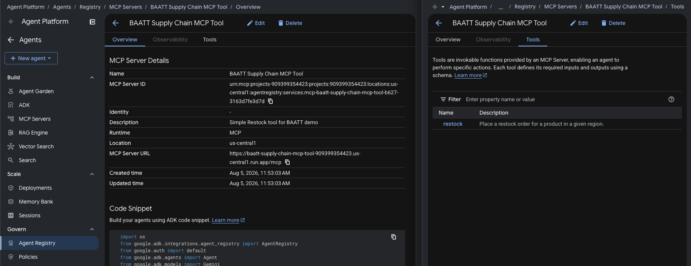

# Supply Chain MCP Tool

An MCP server on Cloud Run exposing a single `restock` tool. This is the resource the agent ultimately calls. The agent will have to go through the agent gateway (and the agent-gateway-extension-service) to get here. This MCP Server also verifies the OAuth token that the gateway injects.

The `restock` handler itself is a mock that returns a hardcoded accepted order — the demo's point is the auth boundary, not the business logic.

## Configure

### 1. Create the Supply Chain MCP Tool resource in PingOne

In PingOne, create a **Resource** named `BAATT Supply Chain MCP Tool` with the `supply-chain:restock` scope and `supply-chain-mcp-tool` audience.


Then make the resource prove who delegated to whom — PingOne doesn't populate the RFC 8693 `act` (actor) claim automatically. On the resource's **Attributes** tab, configure two attributes:

| Attribute | Required | Advanced Expression |
|---|---|---|
| `sub` | no | `(#root.context.requestData.grantType == "client_credentials") ? "no-subject" : #root.context.requestData.subjectToken.client_id` |
| `act` | **yes** | `(#root.context.requestData.grantType == "client_credentials")?"noActor":((#root.context.requestData.subjectToken.may_act.sub == #root.context.requestData.actorToken.client_id)?{"sub":#root.context.requestData.actorToken.client_id}:null)` |

- On a token exchange, `sub` carries the subject token's `client_id` through — the BAATT subject is an agent's `client_credentials` token, which has **no `sub` claim**, so the exchanged token's identity must come from `client_id`. On the extension service's own `client_credentials` actor-token fetch (no delegation involved), it stamps the literal `no-subject`.
- On a token exchange, `act` is set to the exchanging actor's identity only if the subject token's `may_act` names that actor — the extension; otherwise it returns `null`, which fails the exchange outright since `act` is **Required**. That is the enforcement: nothing but the extension can exchange an agent token onto this resource.

### 2. Configure environment values

```bash
cp .env.sample .env
```

| Variable | Value |
|---|---|
| `GC_REGION` | GCP region, e.g. `us-central1` |
| `GC_CLOUD_RUN_SERVICE_NAME` | Cloud Run service name, e.g. `baatt-supply-chain-mcp-tool` |
| `IDP_ISSUER` | PingOne issuer URL, e.g. `https://auth.pingone.com/<env-id>/as`. |
| `IDP_REQUIRED_AUDIENCE` | Expected `aud` claim, e.g. `supply-chain-mcp-tool` |
| `IDP_REQUIRED_SCOPE` | Scope the inbound token must carry, e.g. `supply-chain:restock` |

## Deploy

```bash
make deploy
```

`deploy` runs `setup`, then `push`, then `gcloud run deploy`.

## Register

Register the server in the Agent Registry (Agent Platform → Govern → Agent Registry → Add MCP Server).
- **Name:** BAATT Supply Chain MCP Tool
- **Description:** Simple Restock tool for BAATT demo
- **Region:** Same as Cloud Run deployment (`us-central-1`)
- **MCP Server URL:** `<URL of Cloud Run MCP Server>/mcp`
- **Tool specification JSON:** Paste the contents of `tool-spec.json`


