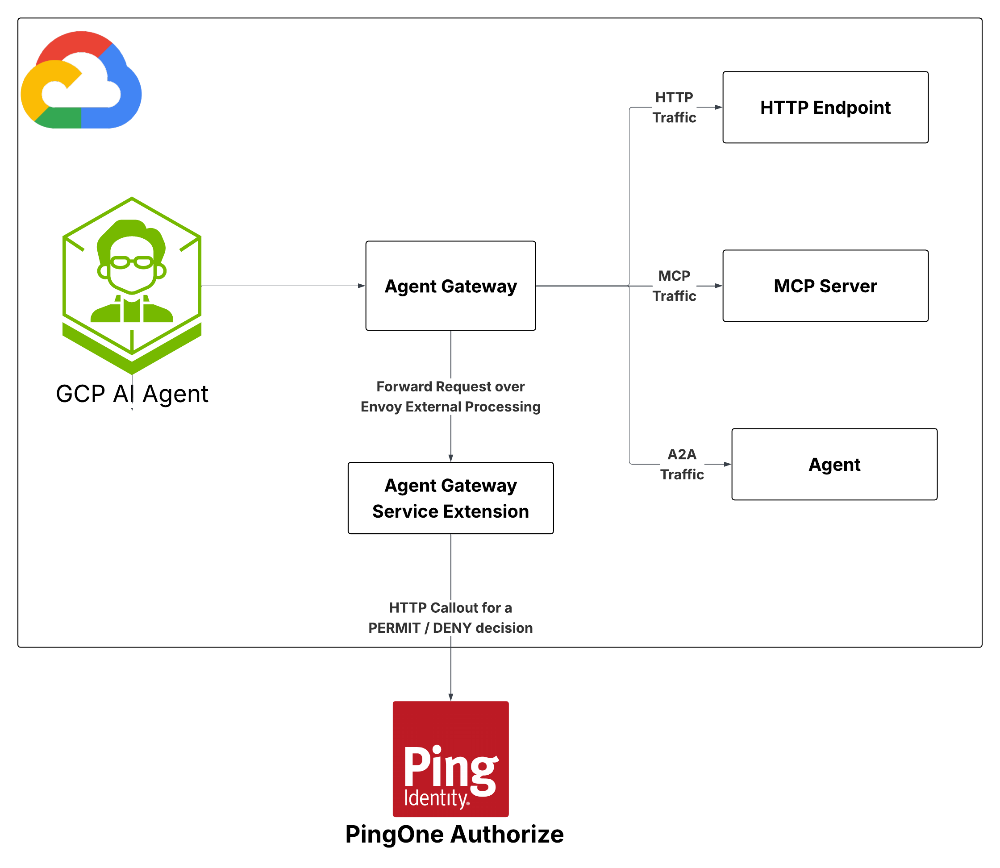

# Authorization Architecture Reference

This document describes three architectures for enforcing PingOne Authorize policy on AI agents and MCP servers running on the Gemini Enterprise Agent Platform. In all three, the calling agent never holds a credential for the tool or agent it calls: the gateway validates the inbound token, consults PingOne Authorize for a PERMIT/DENY, and mints a fresh, narrowly-scoped token before forwarding.

## The three architectures

| # | Journey | Scenario |
|---|---|---|
| 1 | [Baseline Autonomous Agent to Tool](baseline-autonomous-agent-to-tool/) | CRM agent → supply-chain MCP tool. Agent-only identity, no user. |
| 2 | [Agent on Behalf of User](agent-on-behalf-of-user/) | User → Financial agent → Stripe MCP. User identity delegated through the agent. |
| 3 | [Agent Chaining](agent-chaining/) | User → Support Agent → Order Status Agent → Order Status MCP server. User identity delegated through the entire chain. |

## High Level Architecture
- **Policy Enforcement Point:** Google Cloud Agent Gateway
- **Policy Decision Point:** PingOne Authorize

  

## Technologies

- [Google Cloud Agent Gateway](https://docs.cloud.google.com/gemini-enterprise-agent-platform/govern/gateways/agent-gateway-overview)
- [Envoy ext_proc](https://www.envoyproxy.io/docs/envoy/latest/configuration/http/http_filters/ext_proc_filter)
- [PingOne Authorize](https://www.pingidentity.com/en/product/pingone-authorize.html)
- [RFC 8693 token exchange](https://docs.pingidentity.com/pingone/use_cases/p1_oauth_2_token_exchange_delegation.html)
