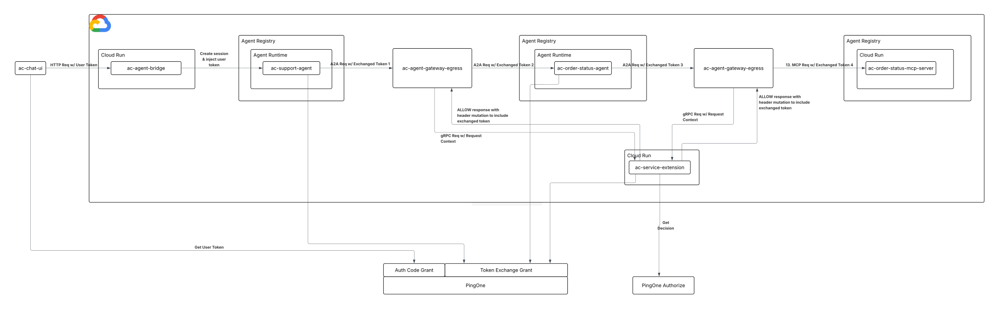

# Agent Chaining

A support agent answers a customer's order-status question by delegating to a specialized order status agent over native [A2A](https://a2aprotocol.ai/), but it never holds a credential for that agent or the [MCP](https://modelcontextprotocol.io/docs/2026-07-28/getting-started/intro) server behind it, and the customer's identity is carried through both hops.

The user logs in via PKCE; their token is exchanged via [RFC 8693 token exchange](https://docs.pingidentity.com/pingone/use_cases/p1_oauth_2_token_exchange_delegation.html) at every hop, first by Support Agent, then again by the [GCP Agent Gateway](https://docs.cloud.google.com/gemini-enterprise-agent-platform/govern/gateways/agent-gateway-overview)'s extension service via [Envoy ext_proc](https://www.envoyproxy.io/docs/envoy/latest/configuration/http/http_filters/ext_proc_filter), which also injects a separate Google-minted credential on this hop, since Order Status Agent's native A2A endpoint is itself a Google-hosted Agent Runtime surface with its own independent IAM check, on top of the PingOne delegation. Order Status Agent repeats the same pattern one hop further, delegating to the Order Status MCP Server. Four RFC 8693 exchanges carry one identity end to end.

## Architecture



Support Agent's and Order Status Agent's own exchanges both target the same shared intermediate resource, the google cloud agent gateway — never the real final resource directly. Only the gateway extension's exchanges ever touch the real final resources.

Following the diagram: the user authenticates through the Chat UI and sends a message to the Agent Bridge, which validates the token and stores it in Support Agent's session state. Support Agent performs its own RFC 8693 exchange and calls Order Status Agent over native A2A; Agent Gateway intercepts that call, remints the token again with its own actor, and separately injects a Google credential the call needs to reach a Google-hosted Agent Runtime endpoint. Order Status Agent validates the reminted token, then performs its own RFC 8693 exchange to call the Order Status MCP Server; Agent Gateway intercepts that call too and remints once more before the MCP server validates the final token and returns the order.

## When to use this pattern

Use this pattern when one agent needs to delegate part of a task to a second, specialized agent that owns a capability the first agent shouldn't access directly — and the human user's identity needs to survive both the agent-to-agent hop and the agent-to-tool hop behind it. This gives you:

- **No standing inter-agent credentials.** Neither Support Agent nor Order Status Agent holds a token that works past its own next hop — each carries only what the previous exchange gave it, and the gateway remints a fresh one before forwarding.
- **Two independent trust layers cross the same wire.** The A2A hop needs both a Google credential (to reach a Google-hosted Agent Runtime endpoint at all) and a PingOne delegated token (for the receiving agent to know who's asking) — carried side by side in the same request, in different parts of it.
- **Least privilege compounds across hops.** Each of the four exchanges narrows scope to exactly the next hop's need; a token minted for Order Status Agent is worthless at the MCP server, and vice versa.

This pattern builds on the [agent on-behalf-of-user](../agent-on-behalf-of-user) demo, extending the delegation model from a single agent-to-tool hop to a full agent-to-agent-to-tool chain, and layering a second, independent Google-credential requirement on top of PingOne delegation for the agent-to-agent hop.

## Token Chain

The token flow begins when the user signs in through the Chat UI. The Support Agent presents the user's token to PingOne as the subject of a token exchange, together with its own client credentials token as the actor. PingOne checks the user token's `may_act` claim against the acting client before minting the delegated token, which still names the user as the subject. The Agent Gateway Extension Service then exchanges that delegated token the same way, minting the token Order Status Agent consumes, and Order Status Agent repeats the pattern once more for the Order Status MCP server. Each exchange adds its actor to the `act` claim, so the terminal token records the full delegation chain. The agent and agent gateway's actor tokens are omitted from this overview for simplicity.

**User token: Chat UI's token**

- Represents the user (`sub`)
- Minted by the Chat UI (`client_id`)
- For use on the Support Agent resource (`aud`)
- Ability to ask the Support Agent for order status (`scope`)
- Only the Support Agent may delegate (`may_act`)

```json
{
  "iss": "https://auth.pingone.<region>/<env-id>/as",
  "sub": "<alice-user-id>",
  "client_id": "<chat-ui-client-id>",
  "aud": "support-agent",
  "scope": "openid support-agent:invoke",
  "grant_type": "authorization_code",
  "may_act": { "sub": "<support-agent-client-id>" }
}
```

**Delegated token 1: Support Agent's exchanged token**

- Represents the user (`sub`) - the agent acts on behalf of the user, not as itself
- Minted by the Support Agent (`client_id`)
- For use on the agent gateway (`aud`)
- Ability to invoke the Order Status Agent (`scope`)
- Delegated by the Support Agent (`act`)
- Only the agent gateway extension service may delegate next (`may_act`)

```json
{
  "iss": "https://auth.pingone.<region>/<env-id>/as",
  "sub": "<alice-user-id>",
  "client_id": "<support-agent-client-id>",
  "aud": "ac-google-cloud-agent-gateway",
  "scope": "order-status:invoke",
  "grant_type": "urn:ietf:params:oauth:grant-type:token-exchange",
  "act": { "sub": "<support-agent-client-id>", "act": null },
  "may_act": { "sub": "<agent-gw-extension-client-id>" }
}
```

**Delegated token 2: Agent Gateway's reminted token for Order Status Agent**

- Represents the user (`sub`) - the user's identity is preserved end to end
- Minted by the agent gateway extension service (`client_id`)
- For use on the Order Status Agent (`aud`)
- Ability to invoke the Order Status Agent (`scope`)
- Delegated by the extension service, on behalf of the Support Agent (`act`)
- Only the Order Status Agent may delegate next (`may_act`)

```json
{
  "iss": "https://auth.pingone.<region>/<env-id>/as",
  "sub": "<alice-user-id>",
  "client_id": "<agent-gw-extension-client-id>",
  "aud": "order-status-agent",
  "scope": "order-status:invoke",
  "grant_type": "urn:ietf:params:oauth:grant-type:token-exchange",
  "act": {
    "sub": "<agent-gw-extension-client-id>", "act": {
      "sub": "<support-agent-client-id>", "act": null
    }
  },
  "may_act": { "sub": "<order-status-agent-client-id>" }
}
```

**Delegated token 3: Order Status Agent's exchanged token**

- Represents the user (`sub`) - the user's identity is preserved end to end
- Minted by the Order Status Agent (`client_id`)
- For use on the agent gateway (`aud`)
- Ability to read orders from the Order Status MCP server (`scope`)
- Delegated by the Order Status Agent, on behalf of the extension service, on behalf of the Support Agent (`act`)
- Only the agent gateway extension service may delegate next (`may_act`)

```json
{
  "iss": "https://auth.pingone.<region>/<env-id>/as",
  "sub": "<alice-user-id>",
  "client_id": "<order-status-agent-client-id>",
  "aud": "ac-google-cloud-agent-gateway",
  "scope": "order:read",
  "grant_type": "urn:ietf:params:oauth:grant-type:token-exchange",
  "act": {
    "sub": "<order-status-agent-client-id>", "act": {
      "sub": "<agent-gw-extension-client-id>", "act": {
        "sub": "<support-agent-client-id>", "act": null
      }
    }
  },
  "may_act": { "sub": "<agent-gw-extension-client-id>" }
}
```

**MCP tool token: Agent Gateway's delegated (exchanged) token**

- Represents the user (`sub`) - the user's identity is preserved end to end
- Minted by the agent gateway extension service (`client_id`)
- For use on the Order Status MCP server (`aud`)
- Ability to read orders (`scope`)
- Delegated by the extension service, on behalf of the Order Status Agent, on behalf of the Support Agent (`act`)
- Terminal: no `may_act`; nothing exchanges further on top of this token

```json
{
  "iss": "https://auth.pingone.<region>/<env-id>/as",
  "sub": "<alice-user-id>",
  "client_id": "<agent-gw-extension-client-id>",
  "aud": "order-status-mcp-server",
  "scope": "order:read",
  "grant_type": "urn:ietf:params:oauth:grant-type:token-exchange",
  "act": {
    "sub": "<agent-gw-extension-client-id>", "act": {
      "sub": "<order-status-agent-client-id>", "act": {
        "sub": "<agent-gw-extension-client-id>", "act": {
          "sub": "<support-agent-client-id>", "act": null
        }
      }
    }
  }
}
```

## Components

| Component | Role |
|---|---|
| [**Chat UI**](services/chat-ui) | React/Vite SPA, PingOne PKCE login |
| [**Agent Bridge**](services/agent-bridge) | Google Cloud entry point; validates user token, stores it in Support Agent's session state |
| [**Support Agent**](services/support-agent) | Reads the user token, exchanges it, calls Order Status Agent over native A2A |
| [**Order Status Agent**](services/order-status-agent) | Validates the inbound delegation, exchanges it again, calls the MCP server |
| [**Order Status MCP Server**](services/order-status-mcp-server) | MCP server (`get_order_status`); validates the final delegated token |
| [**Agent Gateway Extension Service**](services/agent-gateway-extension-service) | ext_proc handler, forwards request to PingOne Authorize, exchanges & injects IdP token |
| [**Agent Gateway**](services/agent-gateway) | Google-managed policy enforcement point; governs both the A2A and MCP hops |
| **PingOne Authorize** | External policy decision point |
| **PingOne** | Identity Provider |

## Prerequisites

- Google Cloud project with billing enabled
- `gcloud` CLI authenticated against the target project
- Docker (to build service images)
- A PingOne environment with PingOne Authorize

## Deployment

### 1. Order Status MCP Server
Follow [order-status-mcp-server](services/order-status-mcp-server/README.md) to build and deploy the Go MCP server to Cloud Run.

### 2. Agent Gateway Extension Service
Follow [agent-gateway-extension-service](services/agent-gateway-extension-service/README.md) to deploy the ext_proc service to Cloud Run. The native A2A target URL can be a placeholder until step 4.

### 3. Agent Gateway
Create the gateway and attach the extension service and authz policy from `services/agent-gateway/` (`make attach`) — this must happen **before** either Agent Runtime engine deploys, since each engine's `deploy.py` binds its egress to `GC_AGENT_GATEWAY` by resource name.

### 4. Order Status Agent
Follow [order-status-agent](services/order-status-agent/README.md) to deploy the native A2A Reasoning Engine. Update the extension's `A2A_TARGET_URL` with the resulting engine ID and redeploy the extension.

### 5. Support Agent
Follow [support-agent](services/support-agent/README.md) to deploy the second Reasoning Engine, bound to the same gateway. Needs Order Status Agent's A2A URL from step 4.

### 6. Agent Bridge
Follow [agent-bridge](services/agent-bridge/README.md) to deploy the Cloud Run session boundary. Needs Support Agent's engine name from step 5.

### 7. Chat UI
Follow [chat-ui](services/chat-ui/README.md) to deploy the browser app. Needs the Agent Bridge URL from step 6.

Both Agent Runtime engines must use the same Agent-to-Anywhere gateway in the same project and region.

## Verify

Open the Chat UI, sign in with a PingOne user who is a member of the `support_team` group, and ask:

> What is the status of order ORD-123?

The agent replies with the order's status (`ORD-123` → shipped, `ORD-456` → processing). The delegation can be observed by following the logs of three Cloud Run services (`ac-agent-gateway-extension-service`, `ac-order-status-mcp-server`) and the Order Status Agent's Reasoning Engine logs while the chat runs. In order, you should see:

```text
# Extension service (A2A hop): the Support Agent's delegated token is validated
# against the shared gateway audience, reminted for the Order Status Agent, and
# injected alongside the Google credential the A2A endpoint's IAM check requires.
[ExtSvc] onHeaders authority="us-central1-aiplatform.mtls.googleapis.com" path=".../reasoningEngines/<order-status-agent-id>/a2a/message:send" matched=true
[ExtSvc] delegated token minted target=A2A ttl=59m30s
[ExtSvc] validated delegated token — sub=<user-sub> aud=ac-google-cloud-agent-gateway scope="order-status:invoke"
[ExtSvc] injecting Google credential + reminted token (aud=order-status-agent scope=order-status:invoke) for A2A

# Extension service: PingOne Authorize is consulted on every governed action
# (A2A message:send and MCP tools/call alike).
[ExtSvc] authorize user=<user-sub> action=get_order_status hour=10
[ExtSvc] PingOne Authorize PERMIT user=<user-sub>
[ExtSvc] PERMIT target=A2A action=get_order_status order=ORD-123 (authz=pingone-authorize)

# Order Status Agent: the gateway-reminted A2A token is validated independently
# (signature, issuer, audience, scope) before use. The log shows who the call
# is for (sub, the user throughout), which audience it was minted for (aud),
# who acted for it (act, the delegation chain so far), and the granted scope.
[OrderStatusAgent] Delegated token verified — sub=<user-sub> aud=['order-status-agent'] act=<ext-svc-client-id> -> <support-agent-client-id> scope="order-status:invoke"

# Order Status Agent: its own exchange mints the MCP-scoped token, then the
# MCP call runs only after the PERMIT above.
[OrderStatusAgent] get_order_status start order_id=ORD-123
[OrderStatusAgent] exchanged for MCP token (aud=order-status-mcp-server), calling MCP server order_id=ORD-123

# Extension service (MCP hop): the Order Status Agent's token is validated and
# reminted for the MCP server; Authorization now carries the PingOne token
# directly (no Google credential needed on this hop).
[ExtSvc] onHeaders authority="ac-order-status-mcp-server-...run.app" path="/mcp" matched=true
[ExtSvc] delegated token minted target=MCP ttl=59m30s
[ExtSvc] validated delegated token — sub=<user-sub> aud=ac-google-cloud-agent-gateway scope="order:read"
[ExtSvc] injecting reminted token (aud=order-status-mcp-server scope=order:read) for MCP
[ExtSvc] authorize user=<user-sub> action=get_order_status hour=10
[ExtSvc] PingOne Authorize PERMIT user=<user-sub>
[ExtSvc] PERMIT target=MCP action=get_order_status order=ORD-123 (authz=pingone-authorize)

# Order Status MCP server: every request's token is verified (signature,
# issuer, audience, scope) before handling. The log shows who the call is for
# (sub, the user throughout), which audience it was minted for (aud), who acted
# for it (act.sub — the full chain: extension -> order status agent ->
# extension -> support agent, the delegation proof), and the granted scope.
[OrderStatusMCP] Token verified — sub=<user-sub> aud=[order-status-mcp-server] act.sub=<ext-svc-client-id> -> <order-status-agent-client-id> -> <ext-svc-client-id> -> <support-agent-client-id> scope="order:read"

# Order Status MCP server: the lookup itself runs only after the PERMIT above.
[OrderStatusMCP] tool=get_order_status — caller=<user-sub> order=ORD-123 status=shipped
```

Outside the governed path, the extension also logs the engines' own Agent Runtime session calls (`matched=false`) — those pass through untouched; only the `matched=true` lines above are governed hops. A DENY from PingOne Authorize (outside business hours, or a user not in `support_team`) surfaces as `[ExtSvc] DENY target=...` followed by an immediate 403, and the agent tells the user the request was denied.
