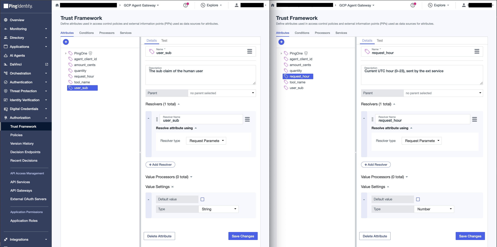
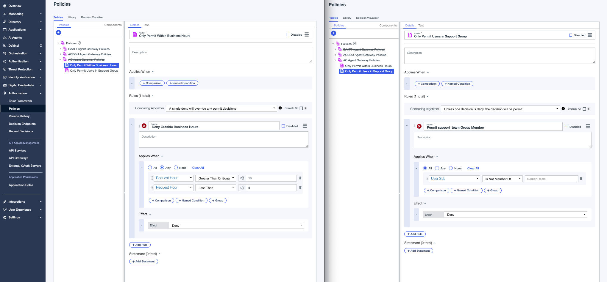
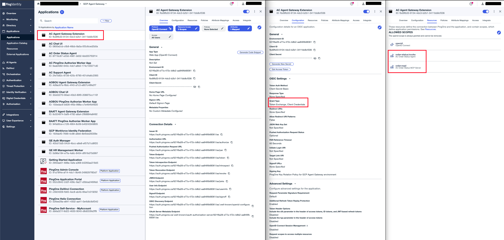

# Agent Gateway Extension Service

An Envoy `ext_proc` gRPC handler that the Agent Gateway calls on every request on the governed path. Deployed on Cloud Run, registered as a Service Extension. It governs both A2A and MCP hops:

```text
Support Agent → native A2A → Order Status Agent
Order Status Agent → MCP → Order Status MCP Server
```

For each matched target it:
1. Validates the caller's delegated token: `iss`, `aud`, and `scope`
2. On the hop's one known action (A2A `message:send`, MCP `tools/call`), calls PingOne Authorize with the user's identity and the request hour; any error, DENY, or unknown body gets an immediate 403 — fail closed, no passthrough
3. On PERMIT, injects the token it reminted via an RFC 8693 exchange to the hop's final audience — `Authorization: Bearer` on the MCP hop; body metadata on the A2A hop, whose `Authorization` instead carries the Google credential that endpoint's IAM check requires

## Configure

### 1. PingOne Authorize - Trust Framework

In **Authorization → Trust Framework**, create the two attributes the extension sends with every decision request. **The attribute Name is the wire contract**: the decision request's parameter keys must byte-match the attribute Name exactly (case-sensitive). The "Resolver Name" shown under each attribute's resolver is a label only — it is NOT matched against request parameters (verified live 2026-09-08: an attribute named `User Sub` with resolver name `user_sub` only resolved when the request sent the key `User Sub`; sending `user_sub` produced `MISSING_ATTRIBUTE`).

| Attribute Name (exact) | Type | Sent by extension as parameter key |
|---|---|---|
| `User Sub` | String | `"User Sub"` |
| `Request Hour` | Number | `"Request Hour"` |

The extension sends these as `{"parameters": {"User Sub": ..., "Request Hour": <hour>}}` on the decision endpoint — flat body, no `decisionRequest` envelope (the envelope the console's Test tab generates is not accepted by the decision endpoint).



### 2. PingOne Authorize - Policies

In **Authorization → Policies**, create a Policy Set named `AC Agent Gateway Policies` with combining algorithm **DenyOverrides** (`Unless one decision is deny, the decision will be permit`). Add these 2 child policies:

**Policy 1: Only Permit Within Business Hours** — combining: A single deny will override any permit decisions
- Rule `Deny Outside Business Hours` — effect **Deny**
  - Applies when (any): `Request Hour` Greater Than Or Equal `18`, `Request Hour` Less Than `8`

**Policy 2: Only Permit Users in Support Group** — combining: Unless one decision is deny, the decision will be permit
- Rule `Deny Non-Members` — effect **Deny**
  - Applies when (any): `User Sub` Is Not Member Of `support_team`

Both policies are deny-only; unmatched requests default to permit at the policy set. Hours are America/Vancouver local — the extension converts from UTC before sending (see the timezone note in the journey CLAUDE.md), so permitted hours are 8:00–17:59 local, not UTC.



### 3. PingOne Authorize - Publish and grab decision endpoint

Go to **Authorization → Version History** and publish the latest version.

Note the decision endpoint URL from **Authorization → Decision Endpoints**.

### 4. PingOne Authorize - Worker App

Create a **Worker** application in PingOne:
- **Name:** AC PingOne Authorize Worker App
- **Grant type:** Client Credentials
- **Roles:** Grant `Environment Admin` and `Identity Data Read Only` scoped to this environment


### 5. PingOne Token Exchange - OIDC Web App

Create an **OIDC Web App application** in PingOne:
- **Name:** AC Agent Gateway Extension
- **Grant Types:** enable both **Client Credentials** and **Token Exchange**
- Assign it both final resources so it may request `order-status:invoke` **from `AC Order Status Agent`** and `order:read` **from `AC Order Status MCP Server`**



### 6. Environment values

```bash
cp .env.sample .env
```

| Variable | Value |
|---|---|
| `GC_REGION` | Deploy region, e.g. `us-central1` |
| `GC_CLOUD_RUN_SERVICE_NAME` | `ac-agent-gateway-extension-service` |
| `IDP_TOKEN_ENDPOINT` | `https://auth.pingone.<region>/<env-id>/as/token` |
| `IDP_CLIENT_ID` | Token-exchange app Client ID |
| `IDP_CLIENT_SECRET` | Token-exchange app Client Secret |
| `AGENT_GATEWAY_AUDIENCE` | Shared intermediate audience the inbound delegated token must carry, e.g. `ac-google-cloud-agent-gateway` |
| `A2A_TARGET_URL` | Order Status Agent's A2A endpoint (`.../reasoningEngines/<engine-id>/a2a`) |
| `A2A_REQUIRED_AUDIENCE` | Final audience for the A2A hop, e.g. `order-status-agent` |
| `A2A_REQUIRED_SCOPE` | Final scope for the A2A hop, e.g. `order-status:invoke` |
| `MCP_TARGET_URL` | The Order Status MCP server's Cloud Run URL (with `/mcp` path) |
| `MCP_REQUIRED_AUDIENCE` | Final audience for the MCP hop, e.g. `order-status-mcp-server` |
| `MCP_REQUIRED_SCOPE` | Final scope for the MCP hop, e.g. `order:read` |
| `AUTHZ_DECISION_ENDPOINT` | PingOne Authorize decision endpoint URL |
| `AUTHZ_CLIENT_ID` | Authorize worker app Client ID |
| `AUTHZ_CLIENT_SECRET` | Authorize worker app Client Secret |


## Deploy

```bash
make deploy
```

`deploy` runs `setup`, then `push`, then `gcloud run deploy`.
