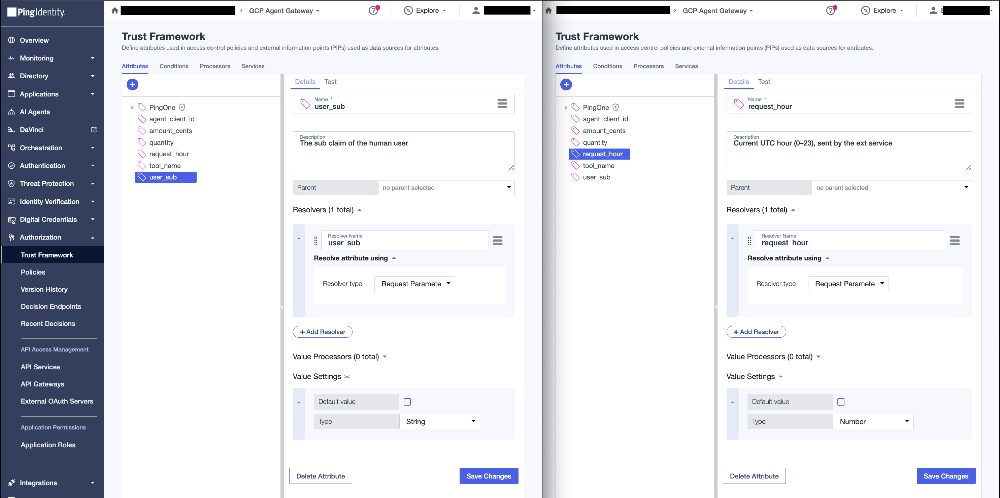
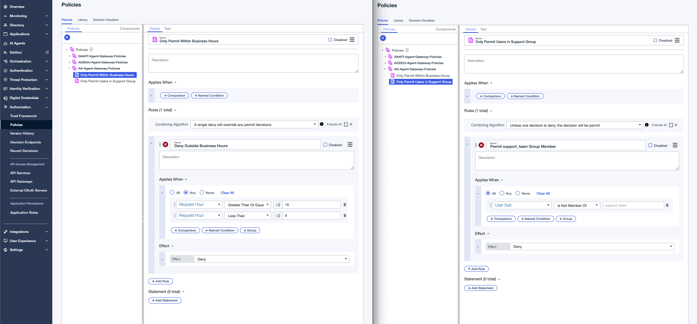
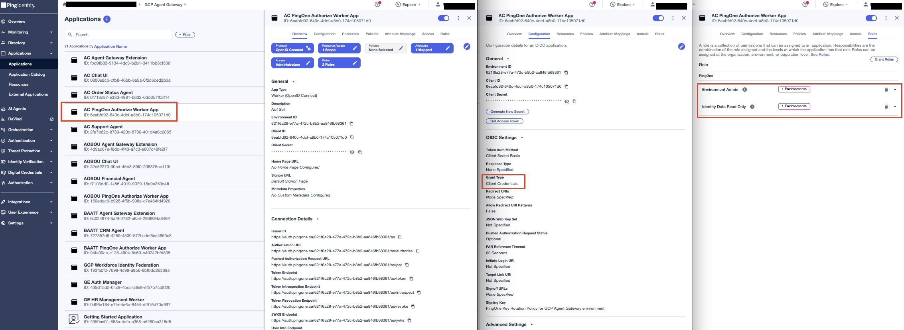
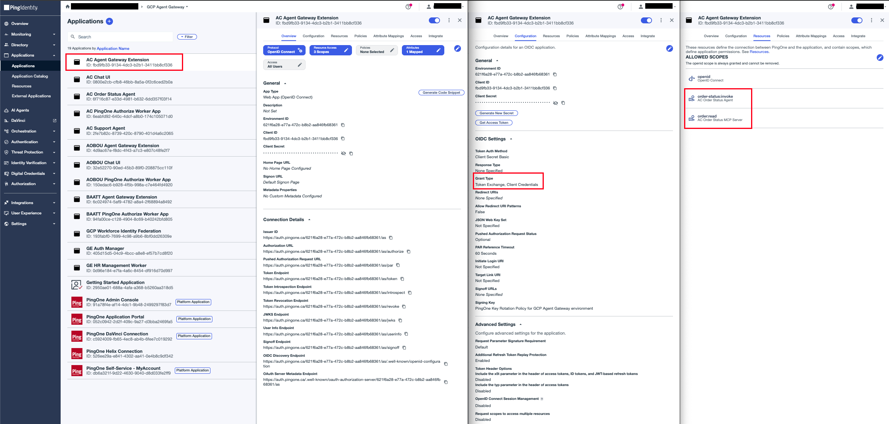

# Agent Gateway Extension Service

An Envoy `ext_proc` gRPC handler that the Agent Gateway calls on every request on the governed path. Deployed on Cloud Run, registered as a Service Extension. It governs both A2A and MCP hops:

```text
Support Agent → native A2A → Order Status Agent
Order Status Agent → MCP → Order Status MCP Server
```

For a request matching a target (MCP traffic aimed at no configured target is denied; other non-target traffic — the engines' own Agent Runtime session calls — passes through untouched):

```
header phase   1. VALIDATE   the caller's delegated bearer: signature via JWKS,
                              then iss (shared gateway audience), scope
                              (per-target)                   → 401 on failure
               2. REMINT     RFC 8693: validated token as subject, this
                              service's client_credentials token as actor,
                              audienced to the hop's real final audience
                                                             → 403 on failure
               3. INJECT     MCP hop → the reminted token as Authorization:
                              Bearer. A2A hop → Authorization instead carries a
                              Google credential (that endpoint's own IAM check);
                              the reminted token rides in the body's metadata
                              (dual-auth)
body phase     4. AUTHORIZE  on the hop's one known action (A2A message:send,
                              MCP tools/call): PingOne Authorize decides
                              PERMIT/DENY (user sub + request hour). Any error,
                              DENY, or unknown body → 403 immediately — fail
                              closed, no passthrough. On PERMIT the dual-auth
                              body gets the reminted token in metadata.
```

It fails closed: every failure above returns an immediate error, and the request never reaches the target. Startup also fails closed — a missing required env var aborts the deploy rather than degrading into a service that skips checks. PingOne Authorize has no bypass mode.

### Where to change what

| To change... | Edit | Where |
|---|---|---|
| Which outbound traffic is governed | the `targets` list built in `newProcessor` + `findTargetForRequest` | `main.go` + `request_policy.go` |
| What the inbound token must carry | `IDP_REQUIRED_AUDIENCE` / `IDP_REQUIRED_SCOPE_AGENT` / `IDP_REQUIRED_SCOPE_TOOL` env vars | `.env` |
| What the policy decides on | the `buildDecisionRequestParams` map + the Trust Framework attributes | `request_policy.go` + PingOne console |
| Which bodies trigger Authorize | `parseRequestActionAndOrderID` (the A2A message-part and MCP `tools/call` shapes) | `request_policy.go` |
| What the outbound tokens are minted for | `AGENT_AUDIENCE`/`AGENT_SCOPE` / `TOOL_AUDIENCE`/`TOOL_SCOPE` env vars | `.env` |

Code layout, in reading order: `main.go` (flow overview + two-target wiring) → `request_policy.go` (per-request decisions — the file you edit) → `gateway_responses.go` (how we answer the gateway — stream loop + builders, incl. the full-body replace for dual-auth) → `p1_token_exchange.go` (RFC 8693 remint, per-target + per-scope caches) → `auth.go` (JWKS validation, one validator per target) → `google_credentials.go` (Google credential for the A2A hop's IAM check) → `p1_authz_client.go` (Authorize transport) → `util.go` (generic helpers).

## Configure

### 1. PingOne Authorize - Trust Framework

In **Authorization → Trust Framework**, create the two attributes the extension sends with every decision request. **The attribute Name is the wire contract**: the decision request's parameter keys must byte-match the attribute Name exactly (case-sensitive). The "Resolver Name" shown under each attribute's resolver is a label only — it is NOT matched against request parameters (verified live 2026-09-08: an attribute named `User Sub` with resolver name `user_sub` only resolved when the request sent the key `User Sub`; sending `user_sub` produced `MISSING_ATTRIBUTE`).

| Attribute Name (exact) | Type | Sent by extension as parameter key |
|---|---|---|
| `User Sub` | String | `"User Sub"` |
| `Request Hour` | Number | `"Request Hour"` |

The extension sends these as `{"parameters": {"User Sub": ..., "Request Hour": <hour>}}` on the decision endpoint — flat body, no `decisionRequest` envelope (the envelope the console's Test tab generates is not accepted by the decision endpoint).



### 2. PingOne Authorize - Policies

In **Authorization → Policies**, create a Policy Set named `AC Agent Gateway Policies` with combining algorithm **DenyOverrides** (`Unless one decision is deny, the decision will be permit`). Add these 2 child policies:

**Policy 1: Only Permit Within Business Hours** — combining: A single deny will override any permit decisions
- Rule `Deny Outside Business Hours` — effect **Deny**
  - Applies when (any): `Request Hour` Greater Than Or Equal `18`, `Request Hour` Less Than `8`

**Policy 2: Only Permit Users in Support Group** — combining: Unless one decision is deny, the decision will be permit
- Rule `Deny Non-Members` — effect **Deny**
  - Applies when (any): `User Sub` Is Not Member Of `support_team`

Both policies are deny-only; unmatched requests default to permit at the policy set. Hours are America/Vancouver local — the extension converts from UTC before sending (see the timezone note in the journey CLAUDE.md), so permitted hours are 8:00–17:59 local, not UTC.



### 3. PingOne Authorize - Publish and grab decision endpoint

Go to **Authorization → Version History** and publish the latest version.

Note the decision endpoint URL from **Authorization → Decision Endpoints**.

### 4. PingOne Authorize - Worker App

Create a **Worker** application in PingOne:
- **Name:** AC PingOne Authorize Worker App
- **Grant type:** Client Credentials
- **Roles:** Grant `Environment Admin` and `Identity Data Read Only` scoped to this environment



### 5. PingOne Token Exchange - OIDC Web App

Create an **OIDC Web App application** in PingOne:
- **Name:** AC Agent Gateway Extension
- **Grant Types:** enable both **Client Credentials** and **Token Exchange**
- Assign it both final resources so it may request `order-status:invoke` **from `AC Order Status Agent`** and `order:read` **from `AC Order Status MCP Server`**



### 6. Environment values

```bash
cp .env.sample .env
```

| Variable | Value |
|---|---|
| `GC_REGION` | Deploy region, e.g. `us-central1` (the project ID is derived from the Cloud Run metadata server at runtime) |
| `GC_CLOUD_RUN_SERVICE_NAME` | `ac-agent-gateway-extension-service` |
| `IDP_ISSUER` | `https://auth.pingone.<region>/<env-id>/as` (the token endpoint is derived as `IDP_ISSUER` + `/token`) |
| `EXCHANGE_CLIENT_ID` | Token-exchange app Client ID (the exchange actor) |
| `EXCHANGE_CLIENT_SECRET` | Token-exchange app Client Secret |
| `IDP_REQUIRED_AUDIENCE` | Shared intermediate audience the inbound delegated token must carry, e.g. `ac-google-cloud-agent-gateway` |
| `IDP_REQUIRED_SCOPE_AGENT` | Scope the inbound A2A-hop token must carry, e.g. `order-status:invoke` |
| `IDP_REQUIRED_SCOPE_TOOL` | Scope the inbound MCP-hop token must carry, e.g. `order:read` |
| `AGENT_ENGINE_ID` | The Order Status Agent's bare Reasoning Engine ID — the mTLS A2A URL is derived from the project ID (metadata server)/`GC_REGION`/this (the gateway only intercepts the mTLS host; the authz policy only matches project-ID-string paths) |
| `AGENT_AUDIENCE` | Final audience for the A2A hop, e.g. `order-status-agent` |
| `AGENT_SCOPE` | Scope minted for the A2A hop's outbound token, e.g. `order-status:invoke` |
| `TOOL_URL` | The Order Status MCP server's Cloud Run URL (host only; the agent calls the full `/mcp` URL) |
| `TOOL_AUDIENCE` | Final audience for the MCP hop, e.g. `order-status-mcp-server` |
| `TOOL_SCOPE` | Scope minted for the MCP hop's outbound token, e.g. `order:read` |
| `AUTHZ_DECISION_ENDPOINT` | PingOne Authorize decision endpoint URL |
| `AUTHZ_CLIENT_ID` | Authorize worker app Client ID |
| `AUTHZ_CLIENT_SECRET` | Authorize worker app Client Secret |


## Deploy

```bash
make deploy
make register
```

`deploy` runs `setup`, then `push`, then `gcloud run deploy` — the Cloud Run service only.
`register` imports this service as an available Service Extension (rendering
`service-extension.tmpl.yaml` with the live Cloud Run URL). It's re-runnable any
time, e.g. after the URL changed; the gateway only routes to it after the policy
in ../agent-gateway binds it — see the [agent-gateway README](../agent-gateway/README.md).
