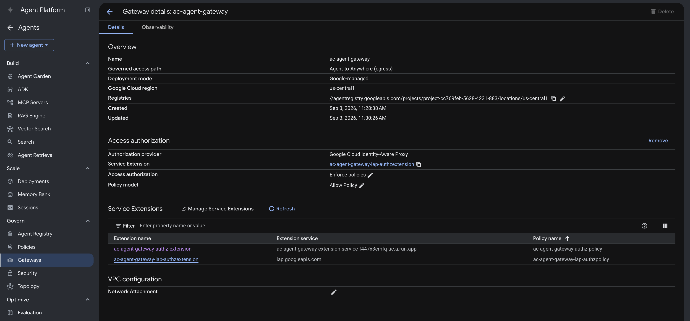

# Agent Gateway

The Agent Gateway is a **Google-managed** resource. You create it in the console and wire it with `gcloud`. It's the policy enforcement point: both agents' egress is routed through it, and it calls the [extension service](../agent-gateway-extension-service/README.md) via Envoy [External Processing (`ext_proc`)](https://www.envoyproxy.io/docs/envoy/latest/configuration/http/http_filters/ext_proc_filter) on every governed request.

Unlike the other journeys, this one has **two agents sharing one gateway** (Support Agent and Order Status Agent must stay deployed concurrently) and **two governed hops** — the A2A hop to Order Status Agent and the MCP hop to the Order Status MCP server.

### 1. Configure environment values

```bash
cp .env.sample .env
```

| Variable | Value |
|---|---|
| `GC_REGION` | Same region as the gateway and Cloud Run services |
| `GC_GATEWAY_NAME` | `ac-agent-gateway` |
| `GC_EXT_SVC_NAME` | Deployed extension service Cloud Run name |
| `GC_AUTHZ_EXTENSION` / `GC_AUTHZ_POLICY` | Names for the two resources this creates |

## 2. Create the gateway

In the console: **Agent Platform → Govern → Gateways → Add gateway**.

| Field | Value |
|---|---|
| **Name** | `ac-agent-gateway` |
| **Region** | Same as the two Cloud Run services |
| **Deployment mode** | Google-managed |
| **Governed Access Path** | Agent-to-Anywhere (egress) |
| **Access Authorization** | Enforce policies |

## 3. Attach the extension service

This wires the extension service to the gateway as a `CONTENT_AUTHZ` authorization extension — two resources: an **authorization extension** (points at your Cloud Run host) and an **authorization policy** (binds that extension to the gateway). Unlike aobou, the policy covers two path prefixes: the Reasoning Engine A2A path (`/v1beta1/projects/.../reasoningEngines/`) and `/mcp`.

```bash
make attach
```

`make attach` renders `authz-extension.tmpl.yaml` and `authz-policy.tmpl.yaml`
(filling in your project, region, and the ext-svc's live Cloud Run host), then
imports both with `gcloud`. Run `make render` alone to inspect the generated YAML
without importing. Config:

> **You'll now see two Service Extensions on the gateway — that's expected.**
> They're complementary, not duplicates:
>
> | Extension | Profile | Service | Role |
> |---|---|---|---|
> | `ac-agent-gateway-iap-authzextension` | `REQUEST_AUTHZ` | `iap.googleapis.com` | Google-managed, **auto-created** with the gateway. Enforces the IAP identity/egress check (`iap.egressor`) — this is the "Auth provider: Google Cloud Identity-Aware Proxy" shown on the gateway. |
> | `ac-agent-gateway-authz-extension` | `CONTENT_AUTHZ` | your Cloud Run ext-svc | The one you just created. Validates the delegated token, calls PingOne Authorize, and remints/injects the per-hop credential. |
>
> The IAP extension answers *"is this agent allowed to egress at all?"*; yours
> answers *"authorize, mint and inject the next-hop credential."* Both run on
> every governed request — leave the IAP one alone.



## 4. Register egress destinations

In **Agent Platform → Govern → Agent Registry**. The gateway governs **all**
agent egress, so every host the agents reach must be a registered destination.
Most are already handled:

- **Order Status MCP Server** — registered under **MCP Servers** when you deployed it. The registered URL must **match the URL the agent actually calls, host-for-host** — IAP resolves egress to a destination by host, and an unmatched host (e.g. the registry holds the stable `...-<PROJECT_NUMBER>.<REGION>.run.app` URL but the agent calls the direct revision `...-<hash>-<REGION>.a.run.app` one) is denied closed before your extension is ever invoked. The tell in the gateway log: `DENIED` with no `agentRegistryResource`.
- **Google APIs** (`aiplatform`, `iamcredentials`, `telemetry` on
  `*.mtls.googleapis.com`) — **auto-created** with the gateway for the runtime's
  own egress. Leave them alone.
- **PingOne** — under **Endpoints → Add endpoint**, Destination URL = your PingOne
  host (e.g. `https://auth.pingone.ca`).


### 5. PingOne resource (`ac-google-cloud-agent-gateway`)

**Create Resource Profile**

1. In the PingOne admin console, go to **Applications > Resources** and click the **+** icon.
2. For **Resource Name**, enter `AC Google Cloud Agent Gateway`.
3. For **Audience**, enter `ac-google-cloud-agent-gateway`.
4. For **Scopes**, enter `order-status:invoke` (used by Support Agent's exchange, hop 1) and `order:read` (used by Order Status Agent's exchange, hop 3).


**Attributes** — this is where the resource proves *who delegated to whom*. Token exchange works without it, but nothing would stop a caller from presenting an `actor_token` and having it accepted at face value; these attributes make PingOne itself attest to the actor, and refuse to mint a token if the actor isn't the one the subject token actually authorized.

1. **`sub`** — open the Advanced Expressions modal (gear icon), enter, and **leave `Required` unchecked**:
   ```text
   (#root.context.requestData.grantType == "client_credentials") ? "no-subject" : #root.context.requestData.subjectToken.sub
   ```
   The `subjectToken.sub` branch carries the user's identity through hops 1 and 3. The `client_credentials` branch is not optional — Support Agent's and Order Status Agent's own actor-token fetches are plain `client_credentials` calls against this resource with no `subjectToken`, and an unconditional expression 400s them all with `sub is configured as required...`, blocking the chain before any exchange runs. Leave `Required` unchecked even though the expression never returns null — the `Required` flag on the well-known `sub` claim is enforced on a separate code path that rejects real `client_credentials` requests even when the expression itself evaluates non-null (reproduced live: tester said non-null, call still 400'd; unchecking the flag alone fixed it).
2. **`act`** — Add attribute, Advanced Expressions, mark **required**:
   ```text
   (#root.context.requestData.grantType == "client_credentials")?"noActor":((#root.context.requestData.subjectToken.may_act.sub == #root.context.requestData.actorToken.client_id)?{"sub":#root.context.requestData.actorToken.client_id,"act":#root.context.requestData.subjectToken.act}:null)
   ```
   Wrapping the subject token's existing `act` inside the new actor (instead of overwriting it) is what makes the terminal token carry the whole delegation history, not just the previous actor — fully expanded chain in the root [README](../../README.md#token-chain).
3. **`may_act`** — Add attribute, Advanced Expressions:
   ```text
   {"sub":"<extension-client-id>"}
   ```
   The one expression here that can't be pasted verbatim: `<extension-client-id>` is the gateway extension's own PingOne client ID — the same value as `IDP_CLIENT_ID` in this service's `.env` (`fbd9fb33-...` in this deployment). It's a constant because hops 1 and 3 are the only exchanges onto this resource, and the only actor allowed next is this extension.
4. **`grant_type`** — Add attribute, Advanced Expressions, **leave `Required` unchecked**:
   ```text
   #root.context.requestData.grantType
   ```
   Adds the minting grant type (`urn:ietf:params:oauth:grant-type:token-exchange` on exchanged tokens) as a first-class claim.
5. Click **Next**.
