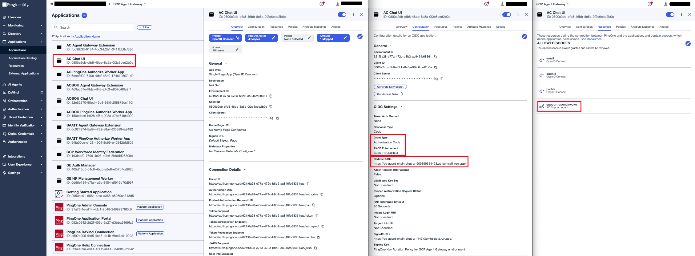

# Chat UI

A React/Vite single-page app. Users log in via PingOne PKCE (Authorization Code + PKCE), then chat with the Support Agent.

## Configure

**1. Create the UI's PingOne application**

Create a **Single Page App** in PingOne:
- Name: Agent Chaining Chat UI
- Grant type: Authorization Code + PKCE
- Redirect URI: the exact value of `VITE_REDIRECT_URI` (the Chat UI Cloud Run URL with a trailing slash), including the trailing slash
- Signoff URI: the exact Chat UI Cloud Run URL
- Scopes: `openid profile email support-agent:invoke` — grant `support-agent:invoke` from the `AC Support Agent` PingOne resource (see [support-agent's README](../support-agent/README.md#2-create-the-agents-pingone-resource)). This scope is what makes PingOne audience the resulting login token to `support-agent` — no `audience`/`resource` parameter is ever sent by this app; PingOne derives `aud` from whichever resource owns the requested scope.



**2. Fill in `.env`:**

```bash
cp .env.sample .env
```

| Variable | Value |
|---|---|
| `GC_REGION` | Deploy region, e.g. `us-central1` |
| `GC_CLOUD_RUN_SERVICE_NAME` | Cloud Run service name, e.g. `agent-chain-chat-ui` |
| `VITE_AIC_ISSUER` | `https://auth.pingone.<region>/<env-id>/as` |
| `VITE_CLIENT_ID` | Chat UI PingOne app Client ID |
| `VITE_REDIRECT_URI` | Chat UI Cloud Run URL |
| `VITE_SCOPES` | `openid profile email support-agent:invoke` |
| `VITE_AGENT_BRIDGE_URL` | Agent Bridge Cloud Run URL |

## Deploy

```bash
make deploy
```

Builds the Vite app, packages it in an nginx Docker image, and deploys to Cloud Run. All `VITE_*` variables (including `VITE_SCOPES`) are baked into the built JS bundle at build time — changing one and only updating the running container's environment does nothing; a full `make deploy` (rebuild) is required.

**Docker's build cache can silently reuse a stale bundle after a `.env` change.** After editing `VITE_SCOPES` and running `make deploy`, the deployed JS bundle still had the old scope baked in (confirmed by the served `index-*.js` filename being byte-identical to the pre-change build) — `docker build` reused a cached layer for `COPY . .`/`RUN npm run build` despite the `.env` content actually differing on disk. `docker build --no-cache` produced a different bundle hash and picked up the change correctly. If a `VITE_*` change doesn't seem to take effect after deploying, check the served bundle's filename against the previous deploy before assuming the PingOne/backend side is wrong — rebuild with `--no-cache` to rule out a stale layer.
