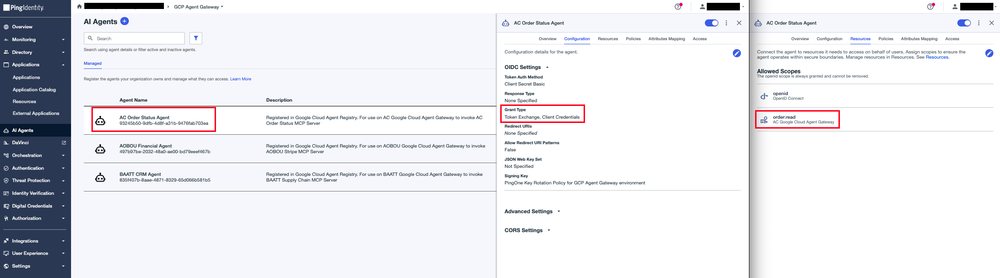
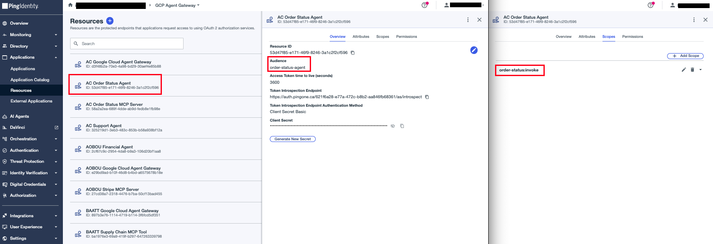
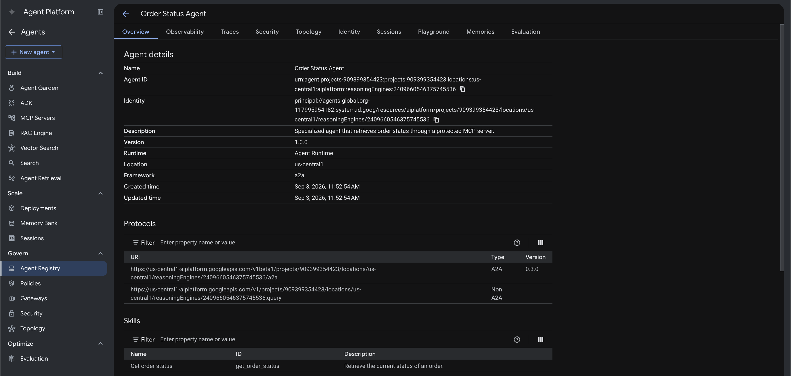

# Order Status Agent

An ADK agent deployed to **Agent Runtime** with native A2A support. It is the specialized downstream agent in the agent chain: it receives `get_order_status` requests from the Support Agent over A2A and is the only agent allowed to call the Order Status MCP Server.

The gateway extension delivers each A2A message with a delegated token in `metadata.delegatedAuthorization`. The agent validates it independently (signature, issuer, audience `order-status-agent`, scope `order-status:invoke`), then performs its own RFC 8693 exchange — using that token as the subject and its own PingOne client as the actor — targeting the shared intermediate `ac-google-cloud-agent-gateway` audience. Agent Runtime routes the outbound MCP egress through the Agent Gateway, where the extension service performs the final exchange to the `order-status-mcp-server` audience on top of this one.

## Configure

**1. Create the agent's PingOne application**

- **Name:** AC Order Status Agent
- **Grant type:** Client Credentials and Token Exchange
- Assign the `ac-google-cloud-agent-gateway` resource so it may request the `order:read` scope



**2. Create the agent's PingOne resource**

- **Resource Name:** `AC Order Status Agent`
- **Audience:** `order-status-agent`
- **Scope:** `order-status:invoke`
- **Attributes:**
  - `sub` — Advanced Expression, `Required` left unchecked:
    ```text
    (#root.context.requestData.grantType == "client_credentials") ? "no-subject" : #root.context.requestData.subjectToken.sub
    ```
  - `act` — Advanced Expression, `Required` checked:
    ```text
    (#root.context.requestData.grantType == "client_credentials")?"noActor":((#root.context.requestData.subjectToken.may_act.sub == #root.context.requestData.actorToken.client_id)?{"sub":#root.context.requestData.actorToken.client_id,"act":#root.context.requestData.subjectToken.act}:null)
    ```
  - `may_act` — Advanced Expression:
    ```text
    {"sub":"<ORDER-STATUS-AGENT-CLIENT-ID>"}
    ```
  - `grant_type` — Advanced Expression
    ```text
    #root.context.requestData.grantType
    ```



Only the gateway extension ever mints against this resource: its A2A-hop remint (hop 2, token exchange) and its own `client_credentials` actor-token fetch for the A2A scope. `sub` is grant-type-aware with **`subjectToken.sub` / `"no-subject"` branches only** — no `#root.user.id` branch. Nothing mints here via `authorization_code` (Chat UI login lands on the `support-agent` resource), and a `#root.user.id` reference would break `client_credentials` mints: the absent user context makes the whole expression fail evaluation and `sub` is dropped from the token entirely (verified 2026-09-09 after a stray console edit set this to `${user.id}`). The `act` expression nests the subject token's own `act` one level deeper so the delegation history survives the remint, and fails the exchange closed if the subject token's `may_act` doesn't name the exchanging actor — the login token's absent `act` flows through as an explicit `null` at the innermost position. `may_act` is a flat constant naming Order Status Agent as the sole next actor — this is what lets hop 3 (this agent's own exchange, targeting the shared gateway audience) carry a valid `act` claim. Set it to this agent's PingOne client ID.

**3. Fill in `.env`:**

```bash
cp .env.sample .env
```

| Variable | Value |
|---|---|
| `GC_PROJECT_ID` | Target project ID |
| `GC_REGION` | Deploy region, e.g. `us-central1` |
| `AGENT_DISPLAY_NAME` | Display name for the Reasoning Engine, e.g. `ac-order-status-agent` |
| `GC_AGENT_GATEWAY` | Full gateway path: `projects/<id>/locations/<region>/agentGateways/<name>` |
| `A2A_ORDER_STATUS_AUDIENCE` | Audience accepted on the inbound A2A token (`order-status-agent`) |
| `A2A_ORDER_STATUS_SCOPE` | Scope accepted on the inbound A2A token (`order-status:invoke`) |
| `MCP_ORDER_STATUS_SERVER_URL` | The Order Status MCP Server's `/mcp` endpoint |
| `MCP_ORDER_STATUS_SCOPE` | Scope requested on the MCP hop (`order:read`) |
| `ORDER_STATUS_AGENT_ID` | Agent identifier, e.g. `order-status-agent` |
| `AGENT_GATEWAY_AUDIENCE` | Shared intermediate PingOne audience this agent's own exchange targets — must match the gateway extension's config |
| `AGENT_IDP_TOKEN_ENDPOINT` | PingOne token endpoint, e.g. `https://auth.pingone.<region>/<env-id>/as/token` |
| `AGENT_IDP_CLIENT_ID` | Agent's PingOne client ID |
| `AGENT_IDP_CLIENT_SECRET` | Agent's PingOne client secret |

## Deploy

```bash
make deploy
```

`deploy.py` creates the Reasoning Engine with `identity_type = AGENT_IDENTITY`, binds it to the gateway, and grants `roles/iap.egressor` on the Agent Registry so the engine can reach all registered endpoints.


