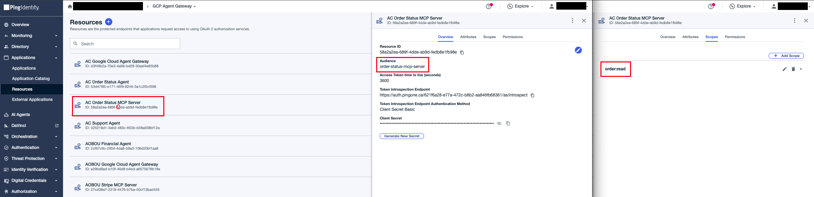
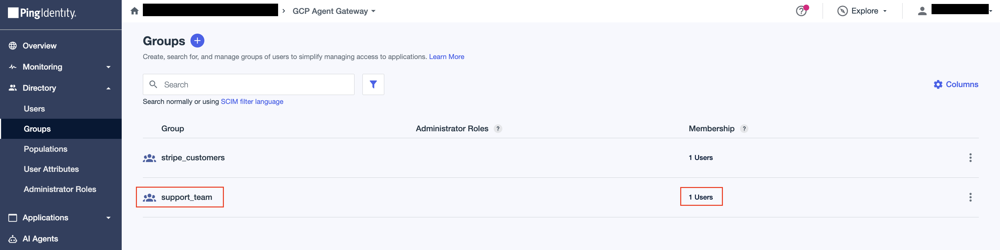
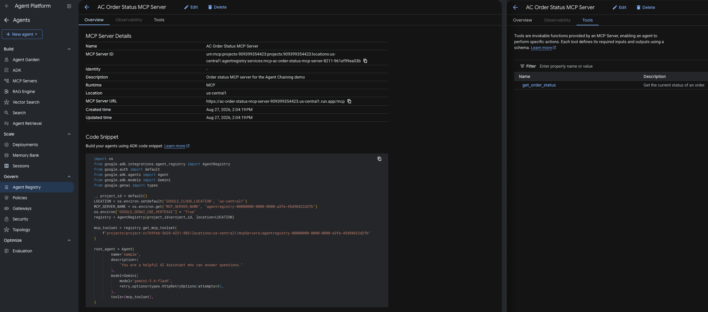

# Order Status MCP Server

An MCP server exposing a `get_order_status` tool. Deployed on Cloud Run and registered as an MCP Server in Agent Registry. This service holds the order data and is the final enforcement point for the whole agent chaining delegation model.

## Configure

### 1. Create the Order Status MCP Server Resource in PingOne

In PingOne, create a **Resource** named `AC Order Status MCP Server` with the `order:read` scope and `order-status-mcp-server` audience.


### 2. Make this resource prove who delegated to whom (`act` claim)

On the `AC Order Status MCP Server` resource, go to the **Attributes** tab and configure two attributes:

1. **`sub`** — click its gear icon to open Advanced Expressions and enter:
   ```text
   (#root.context.requestData.grantType == "client_credentials") ? "no-subject" : #root.context.requestData.subjectToken.sub
   ```
   On a token exchange, this populates the issued token's `sub` with the subject token's `sub` (the user's identity, carried through the hop); on a `client_credentials` request (the gateway extension's own actor-token fetch, which has no user), it stamps the literal string `no-subject` instead, since there is no subject token to copy from.

2. **`act`** — click **Add**, name it `act`, check **Required**, open its Advanced Expressions, and enter:
   ```text
   (#root.context.requestData.grantType == "client_credentials")?"noActor":((#root.context.requestData.subjectToken.may_act.sub == #root.context.requestData.actorToken.client_id)?{"sub":#root.context.requestData.actorToken.client_id,"act":#root.context.requestData.subjectToken.act}:null)
   ```
   On a `client_credentials` request (the gateway extension's own actor-token fetch, where no delegation is involved), it stamps the hard-coded value `noActor`; on a token exchange, it sets `act` only if the subject token's `may_act` matches the actor token's `client_id` — wrapping the actor's identity around the subject token's existing `act` when they match, or returning `null` when they don't, which fails the exchange outright since `act` is marked **Required**. The login token's absent `act` flows through the nesting as an explicit `null` at the innermost position of the final token. `act` is the only attribute marked **Required** on this resource — leave `sub`'s Required checkbox unchecked (a PingOne quirk can 400 `client_credentials` calls on a `Required` `sub` even when the expression never returns null; see the journey CLAUDE.md).

3. **No `may_act`.** This resource is terminal — the MCP server validates the token and the chain ends. Nothing ever exchanges further on top of its output, so no `may_act` attribute belongs here.

4. **`grant_type`** (optional — claim enrichment only, not needed for the demo) — click **Add**, name it `grant_type`, leave **Required** unchecked, open its Advanced Expressions, and enter:
   ```text
   #root.context.requestData.grantType
   ```
   Adds the minting grant type (`urn:ietf:params:oauth:grant-type:token-exchange`) as a first-class claim on the final token.

### 4. Create `support_team` group in PingOne

In **Directory → Groups**, create a group called `support_team` and add any PingOne users who will be allowed to invoke the Order Status MCP server.



### 5. Configure environment values

```bash
cp .env.sample .env
```

| Variable | Value |
|---|---|
| `GC_REGION` | GCP region, e.g. `us-central1` |
| `GC_CLOUD_RUN_SERVICE_NAME` | Cloud Run service name, e.g. `ac-order-status-mcp-server` |
| `IDP_ISSUER` | PingOne issuer URL, e.g. `https://auth.pingone.com/<env-id>/as`. |
| `IDP_REQUIRED_AUDIENCE` | Expected `aud` claim, e.g. `order-status-mcp-server` |
| `IDP_REQUIRED_SCOPE` | Scope the inbound token must carry, e.g. `order:read` |

## Deploy

```bash
make deploy
```

`deploy` runs `setup`, then `push`, then `gcloud run deploy`.

## Register

Register the server in the Agent Registry (Agent Platform → Govern → Agent Registry → Add MCP Server):
- **Name:** `ac-order-status-mcp-server`
- **Description:** Order status MCP server for the Agent Chaining demo
- **Region:** Same as the Cloud Run deployment (e.g. `us-central1`)
- **MCP Server URL:** `<Cloud Run service URL>/mcp`
- **Tool specification JSON:** Paste the contents of `tool-spec.json`

The registered URL must **host-match the URL the Order Status Agent actually calls** (see `MCP_ORDER_STATUS_SERVER_URL` in its `.env`) — IAP resolves egress to a registry destination by host, and an unmatched host is denied closed before the gateway extension is ever invoked. No extra IAM grant is needed after registration: the engines' registry-wide `roles/iap.egressor` binding (applied by each agent's `deploy.py`) is the only egress enforcement.


