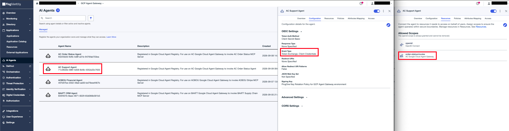
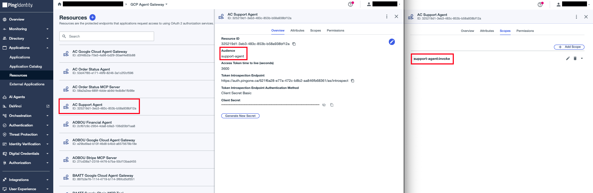
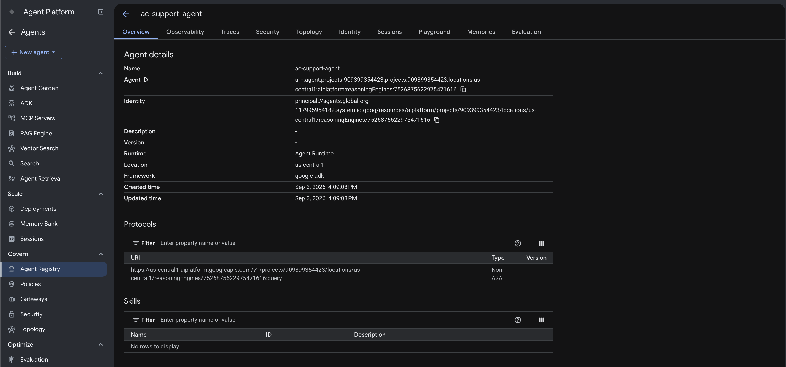

# Support Agent

An ADK agent deployed to **Agent Runtime**. It is the user-facing agent in the agent chain: it delegates order-status requests to the Order Status Agent over A2A and never calls the Order Status MCP Server directly.

The Agent Bridge stores the user's PingOne login token in ADK session state, audienced to this agent's own PingOne resource (`support-agent`). The agent validates it independently (signature, issuer, audience, scope `support-agent:invoke`) before ever using it, then performs its own RFC 8693 exchange — using the user token as the subject and its own PingOne client as the actor — targeting the shared intermediate `ac-google-cloud-agent-gateway` audience. Agent Runtime routes the outbound A2A egress through the Agent Gateway, where the extension service performs the real exchange to the `order-status-agent` audience on top of this one.

## Configure

**1. Create the agent's PingOne application**

- **Name:** AC Support Agent
- **Grant type:** Client Credentials and Token Exchange
- Assign the `ac-google-cloud-agent-gateway` resource so it may request the `order-status:invoke` scope



**2. Create the agent's PingOne resource**

- **Resource Name / Audience:** `support-agent` (must match `SUPPORT_AGENT_AUDIENCE` exactly — it becomes the `aud` claim on the Chat UI's login token)
- **Scope:** `support-agent:invoke`
- **Attributes:**
  - `may_act` — Advanced Expression:
    ```text
    {"sub":"<SUPPORT-AGENT-CLIENT-ID>"}
    ```
  - `grant_type` — Advanced Expression, `Required` left unchecked:
    ```text
    #root.context.requestData.grantType
    ```



This resource sees exactly one grant type — `authorization_code` at Chat UI login — so the default User ID mapping for `sub` is all it needs (nothing ever mints `client_credentials` here; this agent's own actor token resolves to the `ac-google-cloud-agent-gateway` resource via its scope grant). This mirrors the AOBOU Financial Agent resource. Deliberately **no `act` attribute**: no actor exists at login, so the login token omits `act` entirely, and the gateway resource's nested expression turns that absence into an explicit `null` at the innermost position of every downstream token. `may_act` is a flat constant licensing Support Agent as the sole actor allowed to exchange this token next (hop 1) - set it to this agent's PingOne client ID.

**3. Fill in `.env`:**

```bash
cp .env.sample .env
```

| Variable | Value |
|---|---|
| `GC_PROJECT_ID` | Target project ID |
| `GC_REGION` | Deploy region, e.g. `us-central1` |
| `AGENT_DISPLAY_NAME` | Display name for the Reasoning Engine, e.g. `ac-support-agent` |
| `GC_AGENT_GATEWAY` | Full gateway path: `projects/<id>/locations/<region>/agentGateways/<name>` |
| `A2A_ORDER_STATUS_AGENT_URL` | The Order Status Agent's A2A endpoint: `https://<region>-aiplatform.mtls.googleapis.com/v1beta1/projects/<id>/locations/<region>/reasoningEngines/<engine-id>/a2a` |
| `A2A_ORDER_STATUS_SCOPE` | Scope requested on the delegated A2A token (`order-status:invoke`) |
| `SUPPORT_AGENT_AUDIENCE` | Expected `aud` on the inbound browser token (`support-agent`) |
| `SUPPORT_AGENT_EXPECTED_SCOPE` | Expected scope on the inbound browser token (`support-agent:invoke`) |
| `AGENT_GATEWAY_AUDIENCE` | Shared intermediate PingOne audience this agent's own exchange targets — must match the gateway extension's config |
| `AGENT_IDP_TOKEN_ENDPOINT` | PingOne token endpoint, e.g. `https://auth.pingone.<region>/<env-id>/as/token` |
| `AGENT_IDP_CLIENT_ID` | Agent's PingOne client ID |
| `AGENT_IDP_CLIENT_SECRET` | Agent's PingOne client secret |

## Deploy

```bash
make deploy
```

`deploy.py` creates the Reasoning Engine with `identity_type = AGENT_IDENTITY`, binds it to the gateway, and grants `roles/iap.egressor` on the Agent Registry so the engine can reach all registered endpoints.


