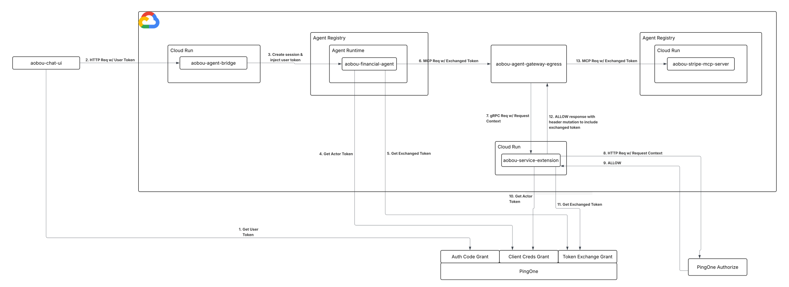

# Agent On-Behalf-Of User

A financial agent purchases [Stripe](https://stripe.com) products on behalf of an authenticated human user - but it never holds a credential for the Stripe [MCP](https://modelcontextprotocol.io/docs/2026-07-28/getting-started/intro) server, and the user's identity is never lost along the way.

The user logs in via PKCE and their token is carried through every hop via [RFC 8693 token exchange](https://docs.pingidentity.com/pingone/use_cases/p1_oauth_2_token_exchange_delegation.html): the agent exchanges it for a delegated token, which the [GCP Agent Gateway](https://docs.cloud.google.com/gemini-enterprise-agent-platform/govern/gateways/agent-gateway-overview) intercepts and hands to an extension service via [Envoy ext_proc](https://www.envoyproxy.io/docs/envoy/latest/configuration/http/http_filters/ext_proc_filter). That service validates the token, resolves the user's email, then asks [PingOne Authorize](https://www.pingidentity.com/en/product/pingone-authorize.html) whether this agent is permitted to act for this user on this transaction. On PERMIT, it exchanges the token again - producing one scoped to the Stripe MCP server - and injects it before forwarding the request.

## Architecture



The user authenticates via the Chat UI (PingOne PKCE) and sends a message to the Agent Bridge. The bridge validates the user's token and stores it raw in the ADK session state, then invokes Agent Runtime. The agent reads the user token from session state and performs an RFC 8693 token exchange to produce a delegated token, which it attaches to each outbound MCP request. Agent Runtime routes those requests through the Agent Gateway, which calls the extension service. The extension service validates the delegated token, calls PingOne Authorize with the request context, and on PingOne Authorize approval performs a second RFC 8693 token exchange to produce a tool-scoped token before the request reaches the target MCP server.

## When to use this pattern

Use this pattern when an agent must act on behalf of a specific human user and the tool needs to know who that user is. The user proves their identity at login; their identity is carried through every hop so the gateway can verify both who the agent is and who it is acting for before any tool call executes. This gives you:

- **No user credentials in the agent.** The agent never holds a token that grants the user's full authority - only a delegated token scoped to one tool, valid for one request.
- **Compound authorization.** PingOne Authorize evaluates the agent's identity and the user's identity together. A rogue agent cannot use a stolen user token, and a user cannot invoke a tool through an unauthorized agent.
- **User identity at the tool.** The MCP server receives the user's email, not just an agent token - enabling per-user Stripe lookups, receipts, and audit records.

This pattern builds on the [baseline autonomous agent-to-tool](../baseline-autonomous-agent-to-tool) demo, extending the delegation model to carry a human user's identity through the exchange.

## Token Chain

The user's identity is carried through every hop as a chain of RFC 8693 delegation exchanges. Each hop adds an `act` (actor) claim nesting the previous one, so the final token at the MCP server shows the full chain: user → agent → extension service. PingOne enforces the delegation itself: each token carries `may_act` naming the only actor allowed to exchange it next, and the exchange fails closed unless the actor token's client matches.

**Subject token** (the user's PKCE token, issued after login and stored in ADK session state by the agent bridge):
- Represents the user (see sub)
- Minted by the Chat UI (see client_id and grant type)
- For use on the financial agent's resource (see aud)
- Ability to invoke the downstream Stripe tool
- Licensed for exactly one next actor: the agent (see `may_act`)
```json
{
  "iss": "https://auth.pingone.com/<env-id>/as",
  "sub": "<alice-user-id>",
  "client_id": "<chat-ui-client-id>",
  "aud": "finance-agent",
  "scope": "openid stripe_mcp:invoke",
  "grant_type": "authorization_code",
  "may_act": { "sub": "<agent-client-id>" }
}
```

**Exchanged token 1 (delegated token)** - minted by the agent via RFC 8693, attached to every outbound MCP request:
- Still represents the user (see sub) - the agent acts *on behalf of* Alice, not as itself
- Minted by the agent (see client_id and grant type)
- For use on the agent gateway (see aud)
- Delegation proof: the agent acted for the user, and PingOne verified that against `may_act` at exchange time (see act)
- Licensed for exactly one next actor: the extension service (see `may_act`)
```json
{
  "iss": "https://auth.pingone.com/<env-id>/as",
  "sub": "<alice-user-id>",
  "client_id": "<agent-client-id>",
  "aud": "google-agent-gateway",
  "scope": "stripe_mcp:invoke",
  "grant_type": "urn:ietf:params:oauth:grant-type:token-exchange",
  "act": {
    "sub": "<agent-client-id>",
    "act": null
  },
  "may_act": { "sub": "<ext-svc-client-id>" }
}
```

**Exchanged token 2 (tool token)** - minted by the extension service via RFC 8693 after PingOne Authorize returns PERMIT:
- Still represents the user (see sub) - Alice's identity is preserved end-to-end
- Minted by the extension service (see client_id and grant type)
- For use on the Stripe MCP server (see aud)
- Delegation proof: the extension acted for the agent, who acted for the user - the full chain, verified by PingOne at each exchange (see act)
- Terminal: no `may_act`; nothing exchanges further on top of this token
```json
{
  "iss": "https://auth.pingone.com/<env-id>/as",
  "sub": "<alice-user-id>",
  "client_id": "<ext-svc-client-id>",
  "aud": "stripe-mcp-server",
  "scope": "stripe_mcp:invoke",
  "grant_type": "urn:ietf:params:oauth:grant-type:token-exchange",
  "act": {
    "sub": "<ext-svc-client-id>",
    "act": {
      "sub": "<agent-client-id>",
      "act": null
    }
  }
}
```

`act` nests per hop: each exchange wraps the subject token's own `act` one level deeper, so the terminal token carries the complete delegation history. The innermost `act` is an explicit `null` because the login token (the first token in the chain) carries no `act` claim at all - the user themselves. `may_act` stays flat at every hop because it only ever needs to name the next actor, never a history.

## Components

| Component | Role |
|---|---|
| [**Chat UI**](services/chat-ui) | React/Vite SPA, PingOne PKCE login |
| [**Agent Bridge**](services/agent-bridge) | Google Cloud entry point; validates user token, stores it in ADK session state |
| [**Agent**](services/agent) | Financial agent acting as MCP client; reads user token and performs token exchange |
| [**Agent Gateway Extension Service**](services/agent-gateway-extension-service) | ext_proc handler, forwards request to PingOne Authorize, exchanges & injects IdP token |
| [**Stripe MCP Server**](services/stripe-mcp-server) | MCP server; validates injected token and calls Stripe API |
| [**Agent Gateway**](services/agent-gateway) | Google-managed policy enforcement point |
| **PingOne Authorize** | External policy decision point |
| **PingOne** | Identity Provider |

## Prerequisites

- Google Cloud project with billing enabled
- `gcloud` CLI authenticated against the target project
- Docker (to build service images)
- A PingOne environment with PingOne Authorize
- A Stripe account with products and customers configured

## Deployment

### 1. Stripe MCP Server
Follow the instructions in [stripe-mcp-server](services/stripe-mcp-server/README.md) to deploy this service to Cloud Run and register it in Agent Registry.

### 2. Agent Gateway Extension Service
Follow the instructions in [agent-gateway-extension-service](services/agent-gateway-extension-service/README.md) to deploy this service to Cloud Run.

### 3. Agent Gateway
Follow the instructions in [agent-gateway](services/agent-gateway/README.md) to create the gateway, attach the extension service, and register the egress destinations.

### 4. Agent
Follow the instructions in [agent](services/agent/README.md) to create the agent's PingOne app, deploy it to Agent Runtime, register it, and grant it egress.

### 5. Agent Bridge
Follow the instructions in [agent-bridge](services/agent-bridge/README.md) to deploy this service to Cloud Run.

### 6. Chat UI
Follow the instructions in [chat-ui](services/chat-ui/README.md) to deploy this service to Cloud Run.

## Verify

Open the Chat UI URL, sign in with a PingOne user who has a Stripe customer record, and ask the agent to make a purchase. The agent will confirm the amount and card, and on your confirmation the purchase completes and a receipt email is sent.

The delegation can be observed by following the logs of the two Cloud Run services (`aobou-agent-gateway-extension-service` and `aobou-stripe-mcp-server`) while the chat runs. In order, you should see:

```
# Extension service: every MCP request (initialize, tools/list, tools/call)
# is validated, exchanged, and forwarded with a fresh tool token.
[ExtSvc] request authority="aobou-stripe-mcp-server-...run.app" path="/mcp"
[ExtSvc] aobou-stripe-mcp-server-... /mcp - user=<user-sub> agent=<agent-client-id> email=alice@example.com
[ExtSvc] tool token minted (ttl 59m30s)
[ExtSvc] injecting tool token for aobou-stripe-mcp-server-...run.app

# Extension service: PingOne Authorize is consulted on tools/call only.
[ExtSvc] authorize user=<user-sub> agent=<agent-client-id> tool=create_stripe_payment_intent amount_cents=10000 hour=14
[ExtSvc] PingOne Authorize PERMIT user=<user-sub> agent=<agent-client-id>

# Stripe MCP server: every request's token is verified (signature, issuer,
# audience, scope) before handling. The log shows who the call is for (sub,
# the user throughout), which audience it was minted for (aud), who acted for
# it (act.sub, the extension service - the delegation proof), the granted
# scope, and the resolved caller email.
[SupplyChain] Token verified - sub=<user-sub> aud=[stripe-mcp-server] act.sub=<ext-svc-client-id> scope="stripe_mcp:invoke" caller=alice@example.com

# Stripe MCP server: the purchase itself runs only after the PERMIT above.
[SupplyChain] tool=create_stripe_payment_intent - caller=alice@example.com product_id=prod_... quantity=1 total_price=100.00
[SupplyChain] tool=create_stripe_payment_intent - success: caller=alice@example.com product_id=prod_... quantity=1
```

Two things worth knowing when reading these logs:

- The `initialize` and `tools/list` requests are the agent and tool negotiating the tool schema; only the final `tools/call` goes through PingOne Authorize, which is why the `authorize` line appears once per purchase and not during browsing.
- If the run fails with the agent saying it couldn't purchase, the extension log is the place to look: a DENY from Authorize, a failed token exchange, or a validation error will all show there.
