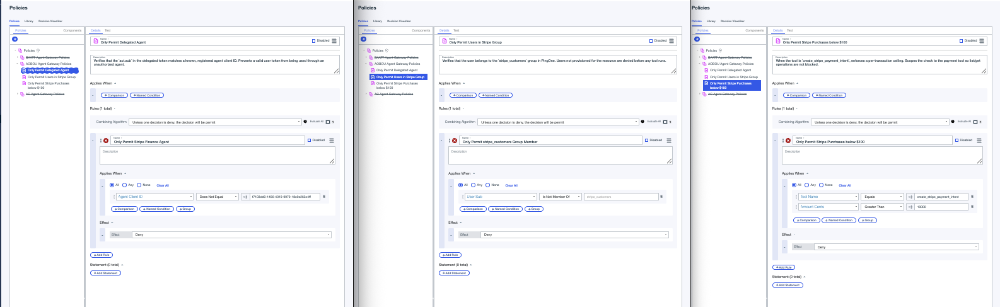
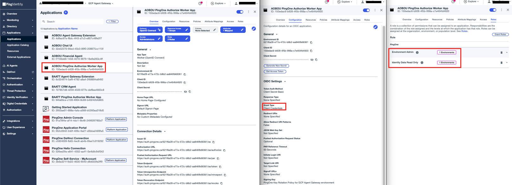

# Agent Gateway Extension Service

An Envoy `ext_proc` gRPC handler that the Agent Gateway calls on every request on the governed path. Deployed on Cloud Run, registered as a Service Extension.

For requests bound to the Stripe MCP tool it:
1. Validates the agent's delegated token: `iss`, `aud`, and `scope`
2. Resolves the user's email from `sub` via the PingOne management API
3. On `tools/call` requests, calls PingOne Authorize with compound attributes; non-`tools/call` requests (initialize, tools/list) skip Authorize
4. On PERMIT, performs an RFC 8693 exchange to produce a tool-audienced token, then injects it as `Authorization: Bearer` and the resolved email as `X-User-Email` before forwarding the request to the Stripe MCP server

## Configure

### 1. PingOne Authorize - Trust Framework

In **Authorization → Trust Framework**, create the attributes the extension sends with every decision request. **The attribute Name is the wire contract**: the decision request's parameter keys must byte-match the attribute Name exactly (case-sensitive). The "Resolver Name" shown under each attribute's resolver is a label only — it is NOT matched against request parameters (verified live 2026-09-08 in the agent-chaining journey: sending the resolver name instead of the attribute Name produced `MISSING_ATTRIBUTE` and every decision evaluated wrong).

| Attribute Name (exact) | Type | Sent by extension as parameter key |
|---|---|---|
| `User Sub` | String | `"User Sub"` |
| `Agent Client ID` | String | `"Agent Client ID"` |
| `Tool Name` | String | `"Tool Name"` |
| `Amount Cents` | Number | `"Amount Cents"` |
| `Request Hour` | Number | `"Request Hour"` |

The extension sends these as `{"parameters": {...}}` on the decision endpoint — flat body, no `decisionRequest` envelope (the envelope the console's Test tab generates is not accepted by the decision endpoint). `Request Hour` is sent on every decision even though none of the deployed policies consume it yet; it is available for business-hours rules.

### 2. PingOne Authorize - Policies

In **Authorization → Policies**, create a Policy Set named `AOBOU Agent Gateway Policies` with combining algorithm **DenyOverrides** (`Unless one decision is deny, the decision will be permit`). Add these 3 child policies:

**Policy 1: Only Permit Delegated Agent** - combining: Unless one decision is deny, the decision will be permit
- Rule `Only Permit Stripe Finance Agent` - condition: `Agent Client ID` does not equal <FINANCE_AGENT_CLIENT_ID>

**Policy 2: Only Permit Users in Stripe Group** - combining: Unless one decision is deny, the decision will be permit
- Rule `Only Permit stripe_customers Group Member` - condition: `User Sub` is not member of `stripe_customers`

**Policy 3: Only Permit Stripe Purchases below $100** - combining: Unless one decision is deny, the decision will be permit
- Rule `Only Permit Stripe Purchases below $100` - condition: `Tool Name` equals `create_stripe_payment_intent`, `Amount Cents` is greater than <your threshold, e.g. `100000` = $1,000>



### 3. PingOne Authorize - Publish and grab decision endpoint

Go to **Authorization → Version History** and publish the latest version.

Note the decision endpoint URL from **Authorization → Decision Endpoints**.

### 4. PingOne Authorize - Worker App

Create a **Worker** application in PingOne:
- **Name:** AOBOU PingOne Authorize Worker App
- **Grant type:** Client Credentials
- **Roles:** Grant `Environment Admin` and `Identity Data Read Only` scoped to this environment



### 5. PingOne Token Exchange - OIDC Web App

Create an **OIDC Web App application** in PingOne:
- **Name:** AOBOU Agent Gateway Extension
- **Grant Types:** enable both **Client Credentials** and **Token Exchange**
- Assign it the `AOBOU Stripe MCP Server` resource so it may request the `stripe_mcp:invoke` scope


### 6. Configure environment values

```bash
cp .env.sample .env
```

| Variable | Value |
|---|---|
| `GC_REGION` | Deploy region, e.g. `us-central1` |
| `GC_CLOUD_RUN_SERVICE_NAME` | `aobou-agent-gateway-extension-service` |
| `IDP_TOKEN_ENDPOINT` | `https://auth.pingone.<region>/<env-id>/as/token` |
| `IDP_CLIENT_ID` | Token-exchange app Client ID |
| `IDP_CLIENT_SECRET` | Token-exchange app Client Secret |
| `IDP_SCOPE` | Scope requested on the outbound tool token, e.g. `stripe_mcp:invoke` |
| `IDP_REQUIRED_AUDIENCE` | Expected `aud` on the **inbound** delegated token. That token is audienced to the gateway resource, so this is `google-agent-gateway` - not the MCP tool's audience |
| `TOOL_URL` | The Stripe MCP tool's Cloud Run base URL |
| `AUTHZ_DECISION_ENDPOINT` | PingOne Authorize decision endpoint URL |
| `AUTHZ_CLIENT_ID` | Authorize worker app Client ID |
| `AUTHZ_CLIENT_SECRET` | Authorize worker app Client Secret |

## Deploy

```bash
make deploy
```

`deploy` runs `setup`, then `push`, then `gcloud run deploy`.
