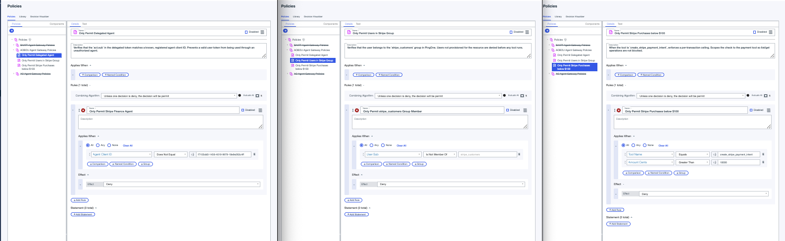
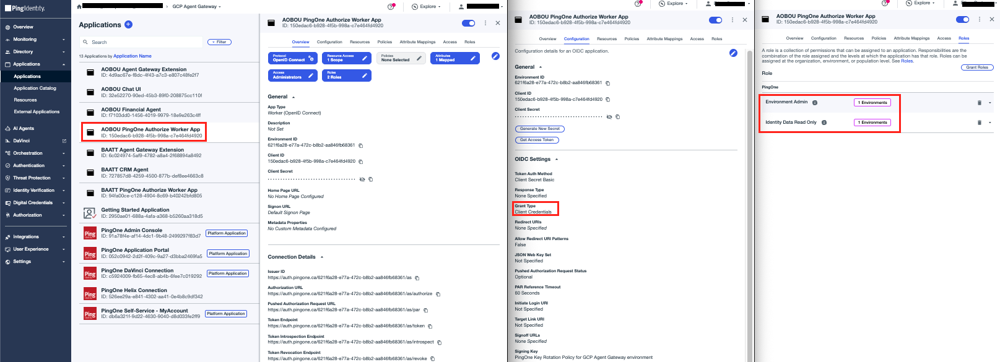
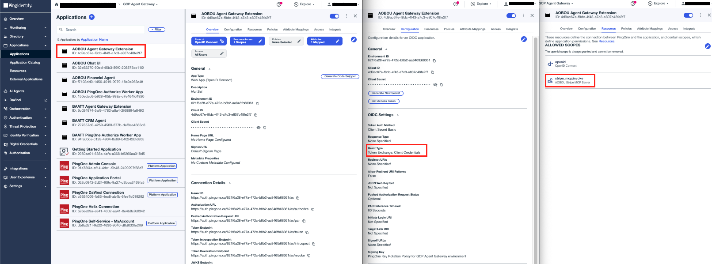

# Agent Gateway Extension Service

An Envoy `ext_proc` gRPC handler that the Agent Gateway calls on every request on the governed path. Deployed on Cloud Run, registered as a Service Extension.

For a request aimed at the Stripe MCP server (MCP traffic aimed at any other host is denied; other traffic — the engine's own Agent Runtime session calls — passes through untouched):

```
header phase   1. VALIDATE   the user's delegated bearer: signature via JWKS,
                              then iss, aud, scope          → 401 on failure
               2. EXCHANGE   RFC 8693: delegated token as subject, this service's
                              client_credentials token as actor → tool-audienced
                              token (cached per subject)      → 403 on failure
               3. RESOLVE    the user's email from sub via the PingOne
                              management API
               4. INJECT     the tool token as Authorization: Bearer and the
                              email as X-User-Email, request the body (BUFFERED)
body phase     5. AUTHORIZE  on tools/call only: PingOne Authorize decides
                              PERMIT/DENY on compound attributes — user + agent
                              + tool + amount (initialize and tools/list skip it)
                                                             → 403 on deny/error
```

### Where to change what

| To change... | Edit | Where |
|---|---|---|
| Which outbound traffic is governed | `isGovernedToolHost` | `request_policy.go` |
| What the inbound token must carry | `IDP_REQUIRED_AUDIENCE` / `IDP_REQUIRED_SCOPE` env vars | `.env` |
| What the policy decides on | the `decisionRequestParams` map in `askPingOneAuthorizeToPermitToolsCall` + the Trust Framework attributes | `request_policy.go` + PingOne console |
| Which body types trigger Authorize | the `readMCPMethod(...) == "tools/call"` check | `request_policy.go` (`handleRequestBodyPhase`) |
| What the outbound token is minted for | `TOOL_SCOPE` / `TOOL_URL` env vars | `.env` |

Code layout, in reading order: `main.go` (flow overview + config/wiring) → `request_policy.go` (per-request decisions — the file you edit) → `gateway_responses.go` (how we answer the gateway — stream loop + response builders) → `p1_token_exchange.go` (RFC 8693 exchange) → `auth.go` (JWKS validation) → `p1_user_resolver.go` (user email lookup) → `p1_authz_client.go` (Authorize transport) → `util.go` (generic helpers). Only the first two ever change when repurposing the service; the rest are protocol plumbing configured by env vars.

## Configure

### 1. PingOne Authorize - Trust Framework

In **Authorization → Trust Framework**, create the attributes the extension sends with every decision request. **The attribute Name is the wire contract**: the decision request's parameter keys must byte-match the attribute Name exactly (case-sensitive). The "Resolver Name" shown under each attribute's resolver is a label only — it is NOT matched against request parameters (verified live 2026-09-08 in the agent-chaining journey: sending the resolver name instead of the attribute Name produced `MISSING_ATTRIBUTE` and every decision evaluated wrong).

| Attribute Name (exact) | Type | Sent by extension as parameter key |
|---|---|---|
| `User Sub` | String | `"User Sub"` |
| `Agent Client ID` | String | `"Agent Client ID"` |
| `Tool Name` | String | `"Tool Name"` |
| `Amount Cents` | Number | `"Amount Cents"` |
| `Request Hour` | Number | `"Request Hour"` |

The extension sends these as `{"parameters": {...}}` on the decision endpoint — flat body, no `decisionRequest` envelope (the envelope the console's Test tab generates is not accepted by the decision endpoint). `Request Hour` is sent on every decision even though none of the deployed policies consume it yet; it is available for business-hours rules.

### 2. PingOne Authorize - Policies

In **Authorization → Policies**, create a Policy Set named `AOBOU Agent Gateway Policies` with combining algorithm **DenyOverrides** (`Unless one decision is deny, the decision will be permit`). Add these 3 child policies:

**Policy 1: Only Permit Delegated Agent** - combining: Unless one decision is deny, the decision will be permit
- Rule `Only Permit Stripe Finance Agent` - condition: `Agent Client ID` does not equal <FINANCE_AGENT_CLIENT_ID>

**Policy 2: Only Permit Users in Stripe Group** - combining: Unless one decision is deny, the decision will be permit
- Rule `Only Permit stripe_customers Group Member` - condition: `User Sub` is not member of `stripe_customers`

**Policy 3: Only Permit Stripe Purchases below $100** - combining: Unless one decision is deny, the decision will be permit
- Rule `Only Permit Stripe Purchases below $100` - condition: `Tool Name` equals `create_stripe_payment_intent`, `Amount Cents` is greater than <your threshold, e.g. `100000` = $1,000>



### 3. PingOne Authorize - Publish and grab decision endpoint

Go to **Authorization → Version History** and publish the latest version.

Note the decision endpoint URL from **Authorization → Decision Endpoints**.

### 4. PingOne Authorize - Worker App

Create a **Worker** application in PingOne:
- **Name:** AOBOU PingOne Authorize Worker App
- **Grant type:** Client Credentials
- **Roles:** Grant `Environment Admin` and `Identity Data Read Only` scoped to this environment



### 5. PingOne Token Exchange - OIDC Web App

Create an **OIDC Web App application** in PingOne:
- **Name:** AOBOU Agent Gateway Extension
- **Grant Types:** enable both **Client Credentials** and **Token Exchange**
- Assign it the `AOBOU Stripe MCP Server` resource so it may request the `stripe_mcp:invoke` scope



### 6. Configure environment values

```bash
cp .env.sample .env
```

| Variable | Value |
|---|---|
| `GC_REGION` | Deploy region, e.g. `us-central1` |
| `GC_SERVICE_EXTENSION_NAME` | Name of the Service Extension resource created when this service is registered (make register), e.g. `aobou-agent-gateway-extension` |
| `GC_CLOUD_RUN_SERVICE_NAME` | `aobou-agent-gateway-extension-service` |
| `IDP_ISSUER` | `https://auth.pingone.<region>/<env-id>/as` (the token endpoint is derived as `IDP_ISSUER` + `/token`) |
| `EXCHANGE_CLIENT_ID` | Token-exchange app Client ID (the exchange actor) |
| `EXCHANGE_CLIENT_SECRET` | Token-exchange app Client Secret |
| `AUTHZ_CLIENT_ID` | Authorize worker app Client ID |
| `AUTHZ_CLIENT_SECRET` | Authorize worker app Client Secret |
| `AUTHZ_DECISION_ENDPOINT` | PingOne Authorize decision endpoint URL |
| `IDP_REQUIRED_AUDIENCE` | Expected `aud` on the **inbound** delegated token |
| `IDP_REQUIRED_SCOPE` | Scope the inbound delegated token must carry |
| `TOOL_URL` | The Stripe MCP tool's Cloud Run base URL |
| `TOOL_SCOPE` | Scope requested on the outbound tool token |

## Deploy

```bash
make deploy
make register
```

`deploy` runs `setup`, then `push`, then `gcloud run deploy` — the Cloud Run service only.
`register` imports this service as an available Service Extension (rendering
`service-extension.tmpl.yaml` with the live Cloud Run URL). It's re-runnable any
time, e.g. after the URL changed; the gateway only routes to it after the policy
in ../agent-gateway binds it — see the [agent-gateway README](../agent-gateway/README.md).
