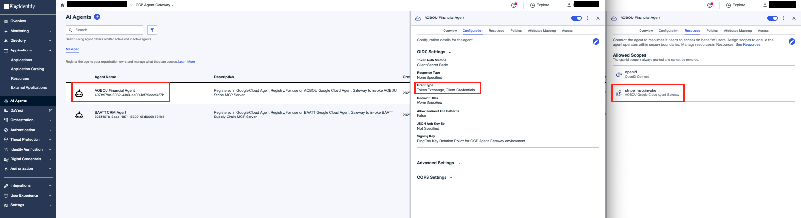
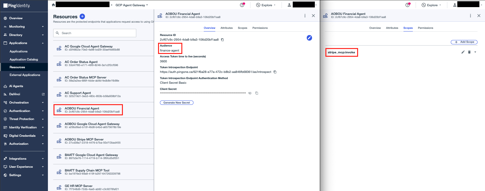
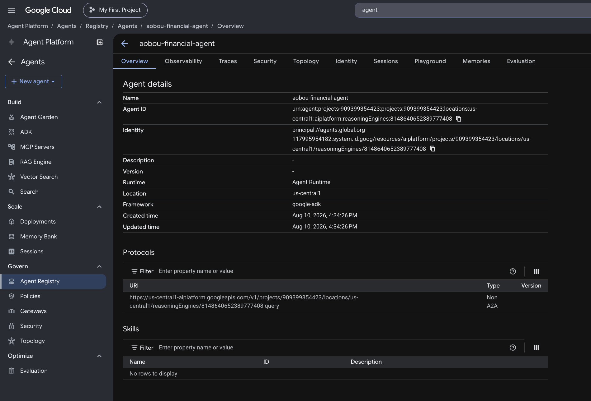

# Financial Agent

An ADK agent deployed to **Agent Runtime**. It is an MCP client: it connects to the Stripe MCP tool and calls financial operations on behalf of the user.

The Agent Bridge stores the user's token in ADK session state. Before each outbound MCP request, the agent performs an RFC 8693 exchange - using the user token as the subject and its own PingOne client as the actor - producing a delegated token that is sent as the Authorization Bearer. Agent Runtime routes that egress through the Agent Gateway (Agent-to-Anywhere), where the extension service uses the delegated token as the **subject** of a second RFC 8693 exchange, minting a tool-audienced token.

## Configure

**1. Create the agent's PingOne application**

- **Name:** AOBOU Financial Agent
- **Grant type:** Client Credentials and Token Exchange
- Assign the `google-agent-gateway` resource so it may request the `stripe_mcp:invoke` scope.



**2. Create the PingOne Resource for the agent**

In PingOne, create a **Resource** named `AOBOU Financial Agent` with the `stripe_mcp:invoke` scope and `finance-agent` audience.



This resource mints the user's login token (the Chat UI's authorization code flow lands here), so it must license the agent as the one allowed next actor. On the resource's **Attributes** tab, configure two attributes:

| Attribute | Required | Advanced Expression |
|---|---|---|
| `may_act` | no | `{"sub":"<AGENT-CLIENT-ID>"}` |

`may_act` is a flat constant naming the agent as the sole next actor - this is what the gateway resource's `act` check compares against at exchange time.

**3. Fill in `.env`:**

```bash
cp .env.sample .env
```

| Variable | Value |
|---|---|
| `GC_PROJECT_ID` | Target project ID |
| `GC_REGION` | Deploy region, e.g. `us-central1` |
| `AGENT_DISPLAY_NAME` | Display name for the Reasoning Engine, e.g. `aobou-financial-agent` |
| `IDP_ISSUER` | PingOne issuer base, e.g. `https://auth.pingone.<region>/<env-id>/as` |
| `GC_AGENT_GATEWAY` | Full gateway path: `projects/<id>/locations/<region>/agentGateways/<name>` |
| `AGENT_CLIENT_ID` | Agent's PingOne client ID (the Financial Agent app) |
| `AGENT_CLIENT_SECRET` | Agent's PingOne client secret |
| `TOOL_MCP_URL` | The Stripe MCP tool's `/mcp` endpoint |
| `TOOL_SCOPE` | Scope requested on the outbound delegated token; the extension's `IDP_REQUIRED_SCOPE` must match |

## Deploy

```bash
make deploy
```

`deploy.py` creates the Reasoning Engine with `identity_type = AGENT_IDENTITY`, binds it to the gateway, and grants `roles/iap.egressor` on the Agent Registry so the engine can reach all registered endpoints.


