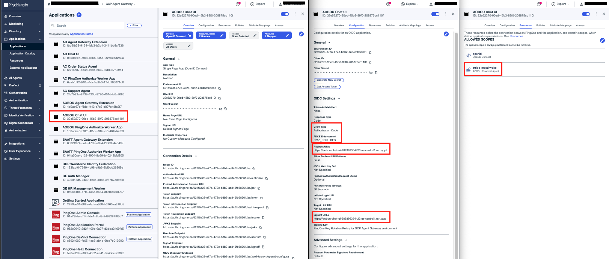

# Chat UI

A React/Vite single-page app. Users log in via PingOne PKCE (Authorization Code + PKCE), then chat with the Financial Agent via the Agent Bridge.

## Configure

**1. Create the UI's PingOne application**

Create a **Single Page App** in PingOne:
- Name: AOBOU Chat UI
- Grant type: Authorization Code + PKCE
- Redirect URI: your Cloud Run URL
- Signoff URI: your Cloud Run URL
- Scopes: `openid stripe_mcp:invoke`



**2. Fill in `.env`:**

```bash
cp .env.sample .env
```

| Variable | Value |
|---|---|
| `GC_REGION` | Deploy region, e.g. `us-central1` |
| `GC_CLOUD_RUN_SERVICE_NAME` | Cloud Run service name, e.g. `aobou-chat-ui` |
| `VITE_AIC_ISSUER` | `https://auth.pingone.<region>/<env-id>/as` |
| `VITE_CLIENT_ID` | Chat UI PingOne app Client ID |
| `VITE_REDIRECT_URI` | Chat UI Cloud Run URL |
| `VITE_SCOPES` | `openid profile email stripe_mcp:invoke` |
| `VITE_AGENT_BRIDGE_URL` | Agent Bridge Cloud Run URL |

## Deploy

```bash
make deploy
```

Builds the Vite app, packages it in an nginx Docker image, and deploys to Cloud Run.
