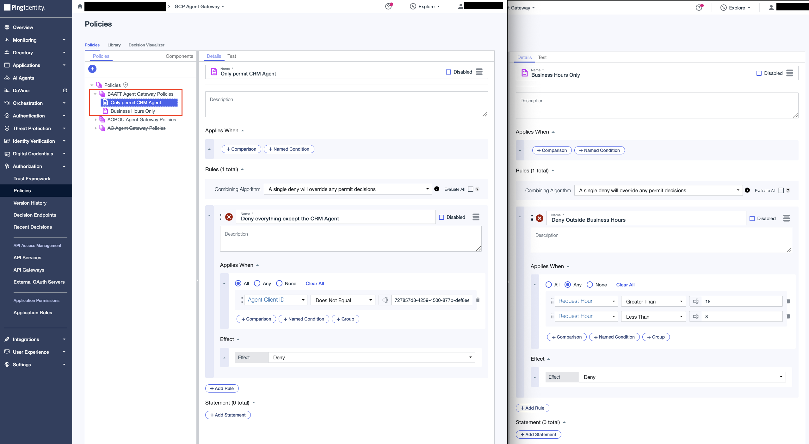
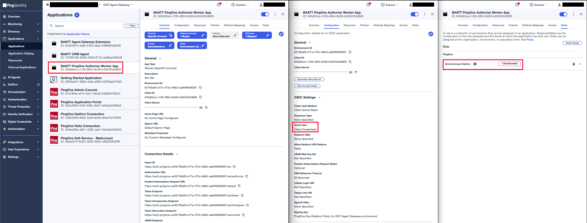
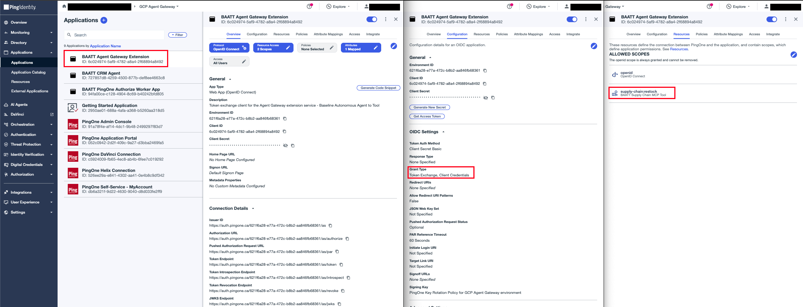

# Agent Gateway Extension Service

An Envoy `ext_proc` gRPC handler that the Agent Gateway calls on every request on the governed path. Deployed on Cloud Run, registered as a Service Extension.

**Two filters decide what this service actually governs.** The gateway's authz policy (../agent-gateway, `make attach`) selects which traffic triggers ext_proc callouts at all — it matches by **path prefix `/mcp`**, so *any* MCP request the agent makes reaches this service, regardless of host. This service then matches by **host** (`isGovernedToolHost` against `TOOL_URL`) and gives only that one the full treatment below. MCP traffic aimed at any other host is denied with 403 — this service is the sole gate for the agent's MCP egress, so an unregistered MCP server can never be reached through the gateway. Non-MCP callouts (the engine's own Agent Runtime session calls) pass through untouched.

## What it does, in execution order

For a request aimed at the MCP tool's host:

```
header phase   1. VALIDATE   the agent's PingOne bearer: → 401 on failure
               2. EXCHANGE   delegation token exchange:  → 403 on failure
               3. INJECT     the tool token as Authorization: Bearer
body phase     4. AUTHORIZE  on tools/call only: PingOne Authorize decides
                              PERMIT/DENY (initialize and tools/list skip it) → 403 on deny/error
```

### Where to change what

| To change... | Edit | Where |
|---|---|---|
| Which outbound traffic is governed | `isGovernedToolHost` (extension side; the gateway-side `/mcp` path rule lives in ../agent-gateway's authz-policy template) | `request_policy.go` + ../agent-gateway |
| What the inbound token must carry | `IDP_REQUIRED_AUDIENCE` / `IDP_REQUIRED_SCOPE` env vars | `.env` |
| What the policy decides on | the `decisionRequestParams` map in `askPingOneAuthorizeToPermitToolsCall` + the Trust Framework attributes | `request_policy.go` + PingOne console |
| Which body types trigger Authorize | the `readMCPMethod(...) == "tools/call"` check | `request_policy.go` (`handleRequestBodyPhase`) |
| What the outbound token is minted for | `TOOL_SCOPE` / `TOOL_URL` env vars | `.env` |

## Configure

### 1. PingOne Authorize - Trust Framework

In **Authorization → Trust Framework**, create the two attributes the extension sends with every decision request. **The attribute Name is the wire contract**: the decision request's parameter keys must byte-match the attribute Name exactly (case-sensitive). The "Resolver Name" shown under each attribute's resolver is a label only — it is NOT matched against request parameters (verified live 2026-09-08 in the agent-chaining journey: sending the resolver name instead of the attribute Name produced `MISSING_ATTRIBUTE` and every decision evaluated wrong).

| Attribute Name (exact) | Type | Sent by extension as parameter key |
|---|---|---|
| `Agent Client ID` | String | `"Agent Client ID"` |
| `Request Hour` | Number | `"Request Hour"` |

The extension sends these as `{"parameters": {"Agent Client ID": ..., "Request Hour": <hour>}}` on the decision endpoint — flat body, no `decisionRequest` envelope (the envelope the console's Test tab generates is not accepted by the decision endpoint).

### 2. PingOne Authorize - Policies

In **Authorization → Policies**, create a Policy Set named `BAATT Agent Gateway Policies` with combining algorithm **DenyOverrides** (`Unless one decision is deny, the decision will be permit`). Under DenyOverrides, unmatched requests default to permit — so the set is deny rules only:

- `Deny other agents` — when `Agent Client ID` is not the CRM agent's client ID
- `Deny outside business hours` — when `Request Hour` is not between 8 and 17 (Pacific)



### 3. PingOne Authorize - Publish and grab decision endpoint

Go to **Authorization → Version History** and publish the latest version.

Note the decision endpoint URL from **Authorization → Decision Endpoints**.

### 4. PingOne Authorize - Worker App

Create a **Worker** application in PingOne:
- **Name:** BAATT PingOne Authorize Worker App
- **Grant type:** Client Credentials
- **Roles:** Grant `Environment Admin` scoped to this environment



### 5. PingOne Token Exchange - OIDC Web App App

Create an **OIDC Web App application** in PingOne
- **Name:** BAATT Agent Gateway Extension
- **Grant Types:** enable both **Client Credentials** and **Token Exchange**
- Assign it the `supply-chain-mcp-tool` resource so it may request the `supply-chain:restock` scope



## Configure environment values

```bash
cp .env.sample .env
```

| Variable | Value |
|---|---|
| `GC_REGION` | Deploy region, e.g. `us-central1` |
| `GC_CLOUD_RUN_SERVICE_NAME` | `baatt-agent-gateway-extension-service` |
| `GC_SERVICE_EXTENSION_NAME` | Name of the Service Extension resource created when this service is registered |
| `IDP_ISSUER` | `https://auth.pingone.<region>/<env-id>/as` |
| `EXCHANGE_CLIENT_ID` | Token-exchange worker app Client ID (the exchange actor) |
| `EXCHANGE_CLIENT_SECRET` | Token-exchange worker app Client Secret |
| `AUTHZ_CLIENT_ID` | Authorize worker app Client ID |
| `AUTHZ_CLIENT_SECRET` | Authorize worker app Client Secret |
| `AUTHZ_DECISION_ENDPOINT` | PingOne Authorize decision endpoint URL |
| `IDP_REQUIRED_AUDIENCE` | Expected `aud` on the inbound token, e.g. `supply-chain-mcp-tool` |
| `IDP_REQUIRED_SCOPE` | Scope the inbound agent token must carry, e.g. `supply-chain:restock` |
| `TOOL_URL` | The MCP tool's Cloud Run base URL |
| `TOOL_SCOPE` | Scope requested on the outbound tool token, e.g. `supply-chain:restock` |

## Deploy

```bash
make deploy
make register
```

`deploy` runs `setup`, then `push`, then `gcloud run deploy` — the Cloud Run service only.
`register` imports this service as an available Service Extension (rendering
`service-extension.tmpl.yaml` with the live Cloud Run URL). It's re-runnable any
time, e.g. after the URL changed; the gateway only routes to it after the policy
in ../agent-gateway binds it — see the [agent-gateway README](../agent-gateway/README.md).
